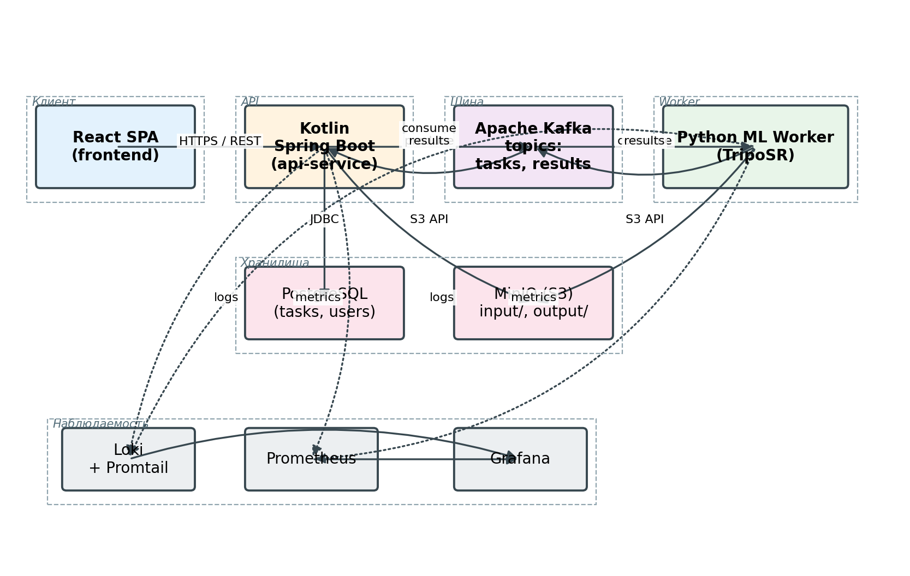
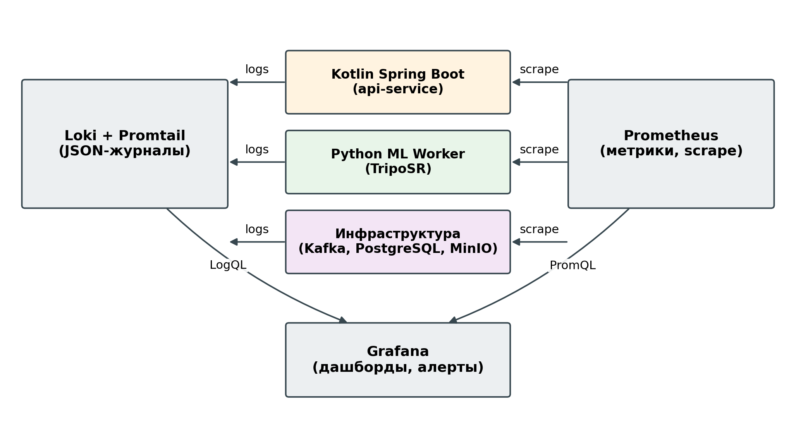
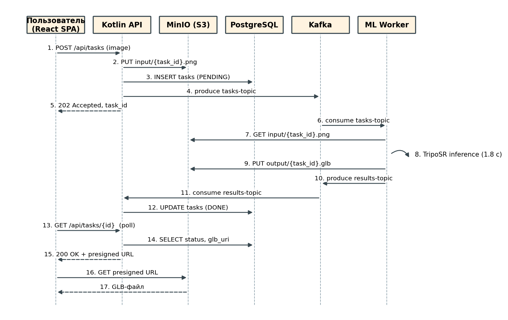
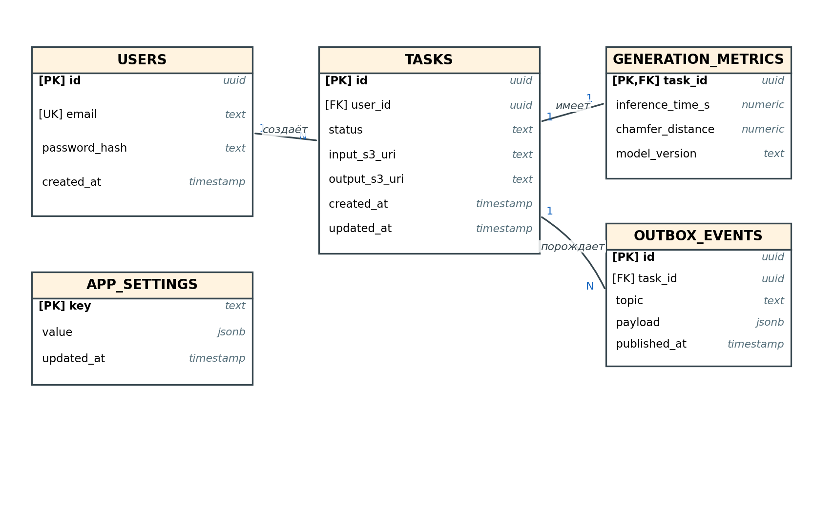

# Проектирование микросервисной архитектуры

<!--
Цель главы: показать как требования из главы 2 трансформируются в архитектурные решения.
Объём: 10-12 страниц (~3000-3500 слов). Большая глава.
КЛЮЧЕВАЯ глава работы — обоснование каждого решения.
-->

## Общая структура системы

Платформа model-forge построена как набор слабосвязанных программных компонентов, взаимодействующих по асинхронным и синхронным каналам в зависимости от характера операции. Высокоуровневая декомпозиция системы на бизнес-компоненты приведена на рисунке 1, кросс-функциональный слой наблюдаемости вынесен на рисунок 2 для сохранения читаемости основной схемы, поток типичного пользовательского запроса — на рисунке 3.



Рисунок 1 – Компонентная диаграмма платформы model-forge: основной поток данных

В составе платформы выделяются следующие функциональные компоненты:

- **Веб-клиент** (`frontend/`) — одностраничное приложение на React, предоставляющее пользователю интерфейс загрузки изображения, наблюдения за статусом задачи и просмотра готовой 3D-модели. Является единственной точкой взаимодействия с внешним миром через браузер; не обращается к внутренним сервисам напрямую.
- **API-сервис** (`kotlin-service/`) — серверное приложение на Kotlin/Spring Boot. Отвечает за приём пользовательских запросов по REST, валидацию входных данных, размещение исходного изображения в объектном хранилище, запись метаданных задачи в реляционную базу и публикацию задания в очередь сообщений. Является stateless-компонентом: всё состояние выносится во внешние хранилища.
- **ML-воркер** (`ml-service/`) — приложение на Python с использованием FastAPI и PyTorch, реализующее инференс модели 3D-реконструкции на основе TripoSR [7]. Подписан на топик заданий очереди, читает входное изображение из объектного хранилища, выполняет инференс, сохраняет полученную полигональную модель обратно в хранилище и обновляет статус задачи в реляционной базе, что является достаточным сигналом завершения для API-сервиса (см. раздел «Контракты сообщений Kafka»).
- **Брокер сообщений** — Apache Kafka, обеспечивающий асинхронную доставку заданий между API-сервисом и ML-воркером с гарантией не менее однократной доставки и возможностью независимого масштабирования числа подписчиков [16].
- **Реляционная база данных** — PostgreSQL, хранящая метаданные задач (идентификаторы, статусы, временные метки, ссылки на бинарные артефакты), пользовательскую историю и агрегаты для аналитического слоя.
- **Объектное хранилище** — MinIO, S3-совместимое хранилище для бинарных артефактов: исходных изображений и сгенерированных 3D-моделей в форматах OBJ и GLB. Доступ к артефактам осуществляется по предварительно подписанным URL-ссылкам, что снимает с API-сервиса нагрузку на проксирование больших файлов.
- **Слой наблюдаемости** — связка Loki, Prometheus и Grafana, обеспечивающая централизованный сбор структурированных JSON-журналов и числовых метрик со всех компонентов и визуализацию ключевых эксплуатационных показателей платформы. Топология подсистемы наблюдаемости вынесена на рисунок 13.
- **Среда исполнения** — все компоненты упакованы в Docker-контейнеры; локальное окружение разработки разворачивается одной командой через docker-compose (`deploy/`).

Подсистема наблюдаемости охватывает все прикладные и инфраструктурные компоненты платформы и реализует два независимых канала телеметрии: журналы и метрики. Структурированные JSON-журналы со всех компонентов отправляются агентом Promtail в Loki в режиме push; числовые метрики собирает Prometheus в режиме периодического опроса (scrape) HTTP-эндпоинтов `/metrics` соответствующих сервисов. Grafana подключается к Loki как источнику логов (через язык запросов LogQL) и к Prometheus как источнику метрик (через PromQL), формируя единую панель оперативного контроля и оповещений. Соответствующая схема приведена на рисунке 2.



Рисунок 2 – Топология подсистемы наблюдаемости платформы model-forge



Рисунок 3 – Диаграмма последовательностей: путь от загрузки изображения до получения 3D-модели

Типичный цикл обработки запроса разворачивается следующим образом. Веб-клиент отправляет HTTP-запрос с изображением в API-сервис. Последний загружает файл в MinIO, создаёт запись о задаче в PostgreSQL со статусом «принята» и публикует сообщение с идентификатором задачи в топик заданий Kafka. Управление немедленно возвращается клиенту с присвоенным идентификатором; от этого момента взаимодействие переходит в асинхронный режим. ML-воркер, выступающий подписчиком топика, забирает сообщение, переводит статус задачи в «в работе», скачивает изображение из MinIO, выполняет инференс, сохраняет результат в MinIO и обновляет статус задачи в PostgreSQL на «завершена». Параллельно веб-клиент опрашивает API-сервис о текущем статусе задачи; при достижении состояния «завершена» интерфейс предоставляет пользователю ссылку на скачивание готовой 3D-модели. Тем самым обратный канал «ML-воркер → API-сервис» реализован не отдельным топиком ответов, а изменением общего состояния в реляционной базе данных.

Изложенная декомпозиция реализует разделение ответственности между «лёгкой» синхронной частью (приём запроса, ведение статуса) и «тяжёлой» асинхронной частью (инференс), что является ключевой предпосылкой для последующего обоснования архитектурных решений.

## Обоснование микросервисной архитектуры

Принципиальный выбор между монолитной и микросервисной архитектурой для платформы model-forge сделан в пользу второй на основании трёх взаимодополняющих аргументов.

**Гетерогенность технологического стека.** Задача платформы естественно распадается на две качественно различные подсистемы. ML-инференс реализуется средствами экосистемы Python с PyTorch и обширным набором библиотек компьютерного зрения, тогда как REST-слой, работа с реляционной базой данных и интеграция с брокером сообщений эффективнее всего выполняются в JVM-стеке (Kotlin/Spring Boot) с его развитой инфраструктурой для построения серверных приложений. Попытка объединить обе подсистемы в едином монолите вынудила бы либо отказаться от части возможностей одной из экосистем, либо встраивать чужеродные runtime-инструменты (например, через Jython или JNI), что снижает поддерживаемость и нарушает принцип использования инструмента, наиболее подходящего для конкретной задачи [18].

**Независимость профилей нагрузки и масштабирования.** API-сервис обрабатывает короткоживущие запросы стоимостью единицы миллисекунд, тогда как ML-воркер выполняет операции стоимостью десятки секунд и потребляет графический ускоритель. Такая асимметрия делает неэффективным масштабирование монолитного приложения, поскольку добавление инстансов вынужденно дублирует и «лёгкие», и «тяжёлые» компоненты, тогда как реальная потребность касается только последних [16, 18]. Микросервисная декомпозиция позволяет горизонтально масштабировать каждую подсистему независимо: на пиках входящего трафика добавляются инстансы API-сервиса, на пиках инференс-нагрузки — реплики ML-воркера, что соответствует требованию ФТ к масштабируемости.

**Изоляция отказов.** В монолитной архитектуре необработанное исключение или утечка памяти в ML-инференсе приводит к остановке всего приложения, в том числе той части, которая обслуживает приём запросов и отдачу истории. В микросервисной архитектуре с асинхронной очередью между сервисами падение или зависание одного экземпляра ML-воркера не препятствует продолжению приёма запросов: задания накапливаются в очереди и будут обработаны при восстановлении воркера или его перебалансировке на другой узел [19]. Этот принцип согласуется с описанным в [20] паттерном «независимо развёртываемых сервисов» как ключевым свойством микросервисной архитектуры.

К числу известных недостатков микросервисной декомпозиции относятся: возрастание операционной сложности (необходимость оркестрации множества контейнеров и наблюдения за каждым), накладные расходы на сериализацию и сетевое взаимодействие, более сложная отладка распределённых сценариев [18, 19]. Применительно к настоящей работе указанные риски смягчаются за счёт ограниченного числа сервисов (три прикладных и три инфраструктурных компонента), единообразной упаковки в контейнеры с автоматическим разворачиванием через docker-compose и сквозной идентификации запросов в журналах. При необходимости масштабирования за пределы одной рабочей станции платформа сохраняет совместимость с типовыми оркестраторами контейнеров за счёт stateless-реализации прикладных сервисов.

## Выбор стека технологий

Технологический стек платформы model-forge формируется в соответствии с принципом «каждый компонент на наиболее подходящем для него инструменте» [18], при условии, что итоговый набор технологий остаётся доступным для эксплуатации одним разработчиком. Ниже приводится обоснование выбора по каждому элементу платформы.

### Python для ML-сервиса

Реализация ML-инференса выполняется на языке Python, что определяется доминирующим положением соответствующей экосистемы в области глубокого обучения и компьютерного зрения. Авторская реализация модели TripoSR [7] поставляется в виде PyTorch-кода; портирование её на другую языковую платформу потребовало бы повторной реализации операторов и потери привязки к актуальной версии модели. Дополнительным фактором служит наличие зрелых библиотек для работы с тензорными вычислениями, обработки изображений и формирования полигональных моделей. Серверный слой ML-воркера построен на FastAPI — асинхронном веб-фреймворке, штатно интегрирующемся с приложениями PyTorch и обеспечивающем сравнимую с компилируемыми языками пропускную способность для лёгких эндпоинтов. Альтернативные варианты — реализация инференса средствами C++ или Julia — рассматривались и отвергнуты как существенно увеличивающие стоимость разработки без гарантированного выигрыша в производительности на одиночных запросах, доминирующих в пользовательском сценарии.

### Kotlin и Spring Boot для серверного слоя

Серверный API-сервис реализован на языке Kotlin поверх фреймворка Spring Boot. Выбор JVM-стека обусловлен зрелостью инфраструктуры построения серверных приложений: декларативные средства описания REST-эндпоинтов, штатная интеграция с PostgreSQL через Spring Data JPA, поддержка работы с Apache Kafka через Spring Kafka, развитая система валидации и управления транзакциями. Использование Kotlin вместо Java мотивировано более компактным синтаксисом, поддержкой неизменяемых типов и null-безопасностью на уровне системы типов, что снижает класс ошибок «NullPointerException» — традиционный источник сбоев в серверных Java-приложениях [16]. Альтернативы (Go, Node.js) рассматривались: Go предоставляет высокую пропускную способность, но обладает менее зрелой экосистемой для работы с реляционными СУБД и Kafka; Node.js слабее справляется с ситуациями длительной CPU-нагрузки и требует ручной поточной модели для надёжной интеграции с типизированными контрактами. Kotlin/Spring Boot выбран как компромисс между скоростью разработки, надёжностью контрактов и эксплуатационной зрелостью.

### React для веб-клиента

Веб-клиент реализован как одностраничное приложение на React. React выбран как наиболее распространённая на текущий момент библиотека построения пользовательских интерфейсов, что обеспечивает доступ к обширной экосистеме готовых компонентов, в том числе для интерактивного отображения 3D-моделей в браузере. Сборка ведётся инструментом Vite, обеспечивающим быстрый цикл разработки за счёт инкрементальной трансляции и нативной поддержки модулей ECMAScript. Альтернативы (Vue, Svelte, Angular) обладают сопоставимыми функциональными возможностями применительно к простому одностраничному интерфейсу, однако уступают React по объёму экосистемы; в условиях исследовательской работы это критерий доминирующий.

### PostgreSQL для метаданных

В качестве реляционной СУБД выбран PostgreSQL. Выбор продиктован реляционной природой хранимых данных: задачи связаны с пользовательской историей и со статусами через явные внешние ключи, агрегаты для аналитического слоя естественно выражаются стандартными конструкциями SQL. PostgreSQL поддерживает транзакционную семантику с уровнем изоляции «repeatable read», необходимым при конкурентном изменении статуса задачи API-сервисом и ML-воркером, и располагает развитой системой индексов и аналитических функций. Альтернативы из класса документных и ключ-значение баз (MongoDB, Redis) были отвергнуты: первая хуже приспособлена для нерегулярных аналитических запросов и не предоставляет жёстких контрактов схемы, вторая не обеспечивает долговременного хранения с гарантиями ACID-семантики [16].

### MinIO для бинарных артефактов

Хранение исходных изображений и сгенерированных 3D-моделей вынесено в отдельное объектное хранилище MinIO. Бинарные данные принципиально отличаются от метаданных по характеру доступа (потоковая запись и чтение целиком, отсутствие частичных обновлений) и по объёму (десятки мегабайт на артефакт против сотен байт на запись метаданных). Хранение бинарных артефактов в реляционной базе как полей типа BYTEA приводит к деградации репликации и резервного копирования за счёт раздувания размера базы [16]. MinIO предоставляет S3-совместимый интерфейс, что обеспечивает переносимость кода: при необходимости перехода в облачную инфраструктуру замена локального MinIO на Amazon S3 или совместимый сервис не требует изменений в прикладном коде. Поддержка предварительно подписанных URL-ссылок снимает с API-сервиса нагрузку проксирования бинарных потоков пользовательского трафика.

Совокупный технологический стек — Python/FastAPI, Kotlin/Spring Boot, React/Vite, PostgreSQL, MinIO — принят как итоговый. Все компоненты распространяются под открытыми лицензиями, что соответствует контекстному ограничению на отсутствие коммерческих зависимостей.

## REST vs gRPC: обоснование выбора

В платформе model-forge используются два качественно различных канала межкомпонентного взаимодействия: синхронный, обращённый к внешнему пользователю, и асинхронный, выполняющий доставку заданий между внутренними сервисами. Выбор протокола для каждого канала рассматривается отдельно.

Внешний канал «веб-клиент ↔ API-сервис» реализован поверх REST (Representational State Transfer) с обменом данными в формате JSON. Решающими факторами в пользу REST выступают: совместимость с любым браузером без дополнительных клиентских библиотек, возможность ручной отладки через стандартные средства (curl, инспектор сети браузера), наличие зрелой инфраструктуры описания контракта в формате OpenAPI и стандартизованных средств кодогенерации [16, 18]. Альтернативный протокол gRPC, основанный на HTTP/2 и буферах протоколов, обеспечивает более компактную сериализацию и более низкую сетевую задержку, однако его прямая поддержка в браузерных средах требует дополнительного gRPC-Web-прокси, что увеличивает сложность инфраструктуры без существенной выгоды для приложения, в котором обмен сообщениями занимает доли процента от времени инференса.

Внутренний канал «API-сервис ↔ ML-воркер» реализован не как синхронный RPC (REST или gRPC), а как асинхронная доставка через брокер сообщений Apache Kafka. Подробное обоснование такого выбора приведено в следующем разделе; здесь зафиксируем сравнение трёх альтернатив, из которого следует решение. Сравнительная характеристика приведена в таблице 2.

Таблица 2 – Сравнение протоколов взаимодействия применительно к внутреннему каналу платформы

| Свойство | REST/HTTP | gRPC | Apache Kafka |
|---|---|---|---|
| Модель взаимодействия | синхронная, request/response | синхронная, request/response (или потоковая) | асинхронная, publish/subscribe |
| Сериализация | JSON, текстовая | Protobuf, бинарная | произвольная (JSON/Avro) |
| Сетевые накладные расходы | средние | низкие | низкие на единицу, оплачивает брокер |
| Удержание соединения на время операции | требуется | требуется | не требуется |
| Буферизация при недоступности подписчика | отсутствует | отсутствует | штатная |
| Гарантия доставки | на уровне HTTP-кода | на уровне статуса вызова | не менее одного раза, с подтверждениями |
| Независимое масштабирование подписчиков | сложное (балансировщик) | сложное (балансировщик) | штатное (consumer group) |
| Применимость к нашему сценарию | низкая | средняя | высокая |

Ключевая особенность задачи — длительность инференса от единиц до десятков секунд при потенциально неравномерном поступлении запросов. В синхронных протоколах (REST и gRPC) такая длительность вынуждает либо удерживать пользовательское соединение на всё время вычисления, либо вводить дополнительный механизм опроса состояния, что сводит синхронный канал к ручной эмуляции асинхронного. Асинхронная доставка через брокер сообщений снимает эту проблему естественным образом, обеспечивая независимость жизненного цикла запроса от состояния подписчика [16, 21]. Таким образом, REST оправдан как пользовательский интерфейс, тогда как для внутренней доставки заданий применён Apache Kafka.

## Обоснование использования Apache Kafka

Выбор Apache Kafka в качестве брокера сообщений между API-сервисом и ML-воркерами опирается на четыре ключевых свойства, существенных в условиях рассматриваемой задачи.

**Буферизация заданий.** Поступление пользовательских запросов носит неравномерный характер, тогда как фактическая пропускная способность ограничивается числом доступных GPU. В отсутствие буфера пиковая нагрузка приводит либо к отказу в обслуживании, либо к деградации пользовательского опыта за счёт долгого ожидания подключения. Kafka реализует устойчивое журналируемое хранение сообщений с настраиваемым сроком хранения, что позволяет принимать и накапливать задания независимо от текущей загруженности воркеров [21]. Применительно к платформе это означает, что при кратковременных пиках входящего трафика API-сервис продолжает приём запросов без участия в фактическом инференсе.

**Гарантия не менее однократной доставки.** Kafka подтверждает фиксацию офсета только после явного подтверждения подписчиком. При сбое ML-воркера в процессе инференса задача остаётся в журнале и будет повторно прочитана либо тем же воркером после восстановления, либо другим участником группы потребителей [21]. Это требование напрямую следует из нефункционального требования по отказоустойчивости и не выполняется автоматически в синхронных RPC-протоколах.

**Независимое горизонтальное масштабирование подписчиков.** Механизм consumer group обеспечивает автоматическое распределение разделов топика между активными экземплярами ML-воркера: при добавлении нового подписчика происходит перебалансировка нагрузки без участия прикладного кода [16, 21]. Это согласуется с нефункциональным требованием по горизонтальному масштабированию (см. раздел «Нефункциональные требования»).

**Воспроизводимость событий.** Журналируемая природа Kafka позволяет повторно обработать ранее опубликованные сообщения, что упрощает отладку и регрессионное тестирование: при изменении версии модели возможен повторный прогон ранее принятых задач без участия пользователя.

Альтернативные брокеры — RabbitMQ и Redis Streams — рассматривались на этапе проектирования. RabbitMQ обладает развитой системой маршрутизации и хорошо подходит для сценариев с разнородными очередями; однако его модель основана на удалении сообщения после подтверждения, что усложняет реализацию воспроизведения событий и требует дополнительных механизмов архивирования [21]. Redis Streams проще в развёртывании, но рассчитан на меньшие объёмы и слабее по гарантиям долговременного хранения. Apache Kafka выбран как наиболее зрелое решение, позволяющее реализовать перечисленные четыре свойства штатными средствами без сторонних обёрток и обладающее пригодным для последующего расширения запасом по производительности.

В рамках платформы используется единственный топик `modelforge.generation.requests` для доставки заданий от API-сервиса к ML-воркерам (`kotlin-service/src/main/kotlin/com/modelforge/service/OutboxScheduler.kt`, `ml-service/src/modelforge/config/settings.py`). Возврат результата отдельным топиком ответов не вводится: о завершении инференса API-сервис узнаёт по обновлению поля `status` в таблице `tasks` со стороны ML-воркера, что сокращает число каналов взаимодействия и устраняет необходимость согласования двух потоков событий. Стратегия разделения топика на партиции и схема сообщений описываются в разделах, посвящённых схеме данных и контрактам.

## Схема данных

В платформе model-forge принят принцип разделения хранилищ по характеру данных: реляционная база PostgreSQL хранит структурированные метаданные задач и пользовательские учётные записи, тогда как бинарные артефакты (исходные изображения и сгенерированные 3D-модели) вынесены в объектное хранилище MinIO и связываются с записями реляционной базы по строковому ключу. Эволюция схемы реляционной базы управляется инструментом Liquibase: структура описывается набором SQL-журналов изменений в каталоге `kotlin-service/src/main/resources/db/changelog/`, что обеспечивает воспроизводимое применение миграций при разворачивании платформы и согласованность схемы между средами разработки и эксплуатации [21].

Структура реляционной базы включает пять основных таблиц, отражающих ключевые предметные сущности и инфраструктурные потребности платформы. Связи между ними показаны на рисунке 4, перечень таблиц и их назначения приведён в таблице 3.



Рисунок 4 – ER-диаграмма основных сущностей реляционной базы платформы model-forge

Таблица 3 – Перечень основных таблиц реляционной базы и их назначение

| Таблица | Ключевые поля | Назначение |
|---|---|---|
| `users` | `id` (UUID, PK), `email` (UNIQUE), `password_hash`, `created_at` | Учётные записи пользователей. |
| `tasks` | `id` (UUID, PK), `user_id` (FK → `users`), `status`, `prompt`, `s3_input_key`, `s3_output_key`, `error_message`, `created_at`, `updated_at` | Жизненный цикл задачи на 3D-реконструкцию: текущий статус, ссылки на бинарные артефакты в MinIO, диагностическое сообщение при сбое, временные метки. |
| `generation_metrics` | `id` (UUID, PK), `task_id` (FK → `tasks`, UNIQUE), `chamfer_distance`, `f_score`, `iou_3d`, `normal_consistency`, `vertices`, `faces`, `inference_time_sec`, `is_mock` | Численные характеристики качества и затрат каждой завершённой генерации. Уникальное ограничение на `task_id` фиксирует связь один-к-одному с таблицей `tasks`. |
| `outbox_events` | `id` (UUID, PK), `event_type`, `payload` (TEXT), `status`, `retry_count`, `created_at`, `published_at` | Реализация паттерна Transactional Outbox для согласованной доставки сообщений в брокер. |
| `app_settings` | `setting_key` (PK), `setting_value` | Динамические эксплуатационные параметры (например, `ml_mock_mode`, `ml_device`), изменяемые без перезапуска сервисов. |

Принципиальные решения, заложенные в схему, перечислены ниже.

- **Идентификаторы как UUID.** Все первичные ключи бизнес-сущностей имеют тип `UUID`. Это снимает зависимость генерации идентификатора от СУБД, упрощает горизонтальное масштабирование за счёт устранения распределённых последовательностей и обеспечивает сквозную корреляцию запросов в журналах подсистем платформы [21].
- **Разделение задачи и метрик.** Численные характеристики качества вынесены в отдельную таблицу `generation_metrics`, а не в дополнительные поля `tasks`. Такое разделение исключает влияние эволюции набора метрик на «горячую» таблицу задач, упрощает каскадное удаление при чистке завершённых задач (`ON DELETE CASCADE`) и допускает отсутствие записи метрик у незавершённых или ошибочных задач без введения NULL-полей в основной таблице.
- **Согласованность с брокером через outbox.** Запись в таблицу `outbox_events` производится в той же транзакции, что и создание задачи в таблице `tasks`. Запланированный компонент `OutboxScheduler` (`kotlin-service/src/main/kotlin/com/modelforge/service/OutboxScheduler.kt`) с интервалом порядка нескольких секунд выбирает события со статусом `PENDING` и публикует их в Kafka, переводя в `PUBLISHED`; при превышении порога повторных попыток событие переводится в `FAILED` с сохранением счётчика. Такой подход исключает класс ошибок «задача создана в БД, но сообщение не отправлено в брокер» без введения распределённых транзакций между PostgreSQL и Kafka, что согласуется с описанием паттерна Transactional Outbox в [19, 21].
- **Разделение бинарных и реляционных данных.** Поля `s3_input_key` и `s3_output_key` хранят только ключи объектов в MinIO, что соответствует принципу хранения больших объектов отдельно от метаданных и минимизирует размер реляционной базы для целей резервного копирования и репликации [21].
- **Индексы под профиль доступа.** На таблицу `tasks` наложены индексы по `user_id` (поиск истории пользователя), `status` (выборка очереди для воркеров и аналитики) и `created_at` (сортировка по времени); на таблицу `outbox_events` — индекс по `status` для быстрого поиска ожидающих публикации событий.

## Контракты сообщений Kafka

Доставка заданий между API-сервисом и ML-воркером реализована через единственный топик Apache Kafka. Имя топика вынесено в конфигурацию платформы (`modelforge.kafka.topic` в `kotlin-service/src/main/resources/application.yml`, переменная окружения `KAFKA_TOPIC` для ML-воркера, см. `ml-service/src/modelforge/config/settings.py`); значение по умолчанию — `modelforge.generation.requests`. Возврат результата выполняется не отдельным топиком-ответом, а обновлением поля `status` в таблице `tasks` со стороны ML-воркера; такое решение сокращает число каналов взаимодействия и устраняет необходимость согласования двух потоков событий в API-сервисе. Подписка на топик группирована: экземпляры ML-воркера объединены в consumer-группу `modelforge.ml-workers`, что обеспечивает автоматическое перераспределение партиций между активными участниками группы при их добавлении и снятии [21].

**Параметры публикации.** Конфигурация продьюсера (`kotlin-service/src/main/kotlin/com/modelforge/config/KafkaConfig.kt`) включает идемпотентную семантику отправки (`enable.idempotence=true`), требование подтверждения от всех синхронизированных реплик (`acks=all`) и трёхкратное повторение при сбоях (`retries=3`). Совокупность этих параметров обеспечивает гарантию ровно однократной публикации каждого события в пределах партиции и исключает удвоение задач при ретраях. В сочетании с описанным выше паттерном Transactional Outbox это даёт согласованную семантику доставки задач от API-сервиса до ML-воркера в типовом сценарии работы.

**Контракт сообщения.** Тело сообщения сериализуется в JSON; схема описана в виде Pydantic-модели `TaskRequest` (`ml-service/src/modelforge/kafka/models.py`). Структура полезной нагрузки приведена в листинге ниже.

```json
{
  "taskId": "f4a1c2e0-9d3b-4f00-8e11-2bc7d9f1a4e2",
  "userId": "1e2b3c4d-5f6a-7b8c-9d0e-1f2a3b4c5d6e",
  "input": {
    "s3_path": "models-input/f4a1c2e0/source.png",
    "format": "png"
  },
  "params": {
    "output_format": "glb",
    "remove_background": true,
    "texture_quality": "high"
  },
  "createdAt": "2026-04-26T15:42:00Z"
}
```

Поля `taskId` и `input.s3_path` обязательны и подвергаются валидации на стороне получателя. Блок `params` имеет значения по умолчанию (`output_format=glb`, `remove_background=true`), что позволяет API-сервису не передавать его при стандартных параметрах генерации. Множество допустимых значений `output_format` ограничено форматами `obj`, `glb`, `usdz`, `stl`, `ply`, что соответствует возможностям пайплайна экспорта результата модели TripoSR [7]. Парсер сообщения на стороне ML-воркера поддерживает оба соглашения именования полей — camelCase, формируемый сериализатором Jackson на стороне Kotlin-сервиса, и snake_case, используемый в части интеграционных скриптов, — что повышает устойчивость к рассогласованию конвенций при совместном развитии сервисов.

**Стратегия разбиения по партициям.** В качестве ключа сообщения Kafka используется идентификатор задачи в виде UUID-строки, передаваемый вторым аргументом метода `kafkaTemplate.send(topic, key, payload)` в публикаторе `OutboxScheduler` (`kotlin-service/src/main/kotlin/com/modelforge/service/OutboxScheduler.kt`). Стандартный разделитель Kafka хеширует ключ по партициям топика, что обеспечивает равномерное распределение нагрузки между партициями и одновременно гарантирует попадание всех событий, относящихся к одной задаче, в одну партицию с сохранением порядка их следования. Альтернативная стратегия с ключом по идентификатору пользователя была отвергнута, поскольку приводила бы к концентрации нагрузки на партициях активных пользователей и требовала бы переразбиения при изменении профиля использования платформы [21].

**Эволюция схемы.** Поскольку контракт описан в исходном коде обоих сервисов, изменение поля требует согласованного обновления Pydantic-модели в ML-воркере и DTO-класса в API-сервисе. Для обеспечения обратной совместимости новые поля вводятся как опциональные, удаление поля выполняется в два шага: сначала получатель прекращает чтение поля, затем отправитель перестаёт его публиковать. Такой подход согласуется с рекомендациями по эволюции схем сообщений в распределённых системах [21] и не требует подключения внешнего реестра схем, что соответствует ограничению на минимизацию инфраструктурных зависимостей платформы.
