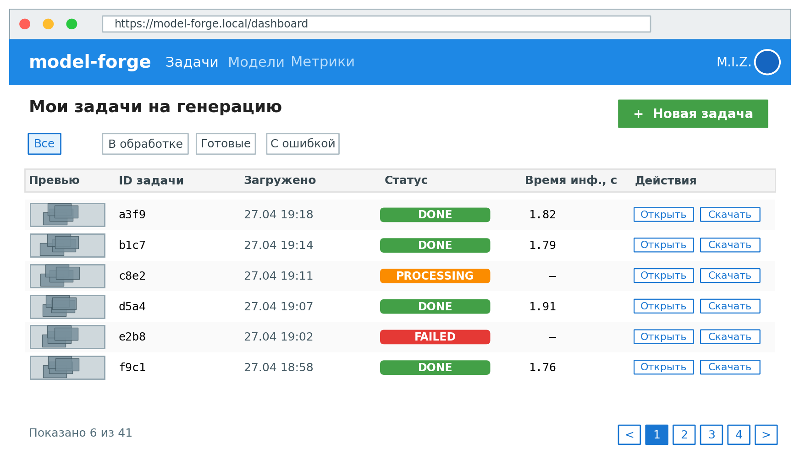
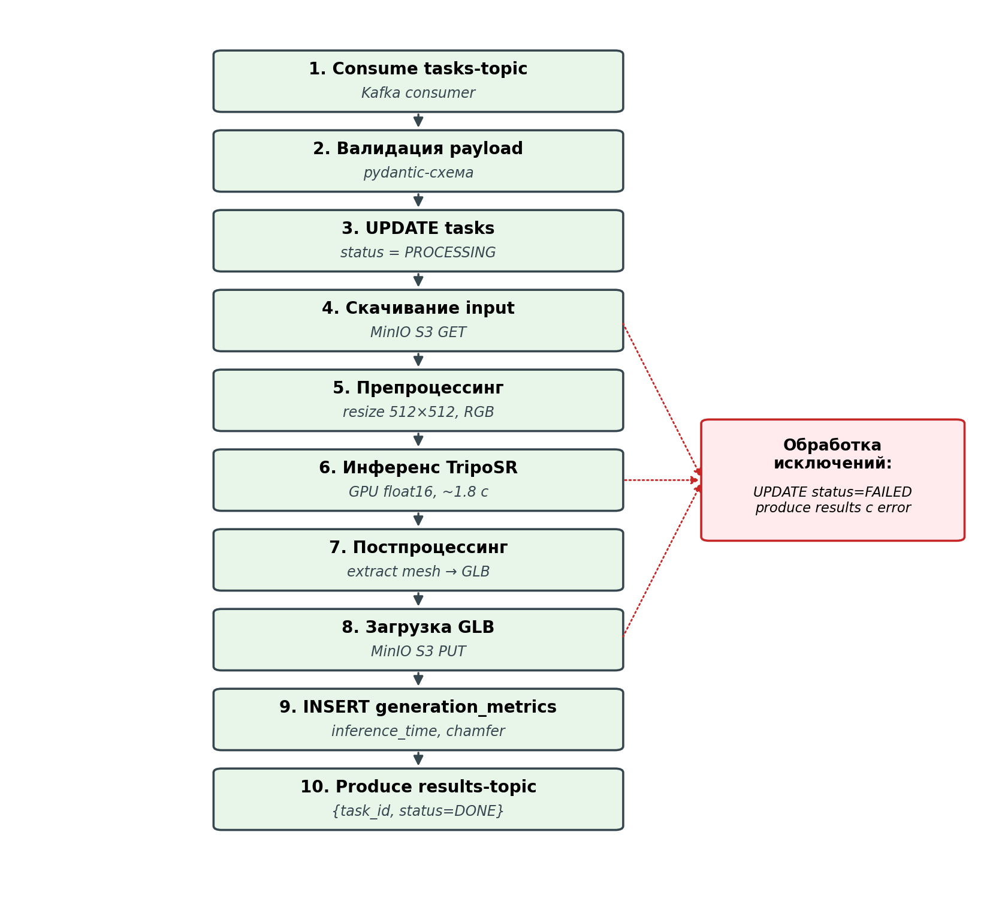
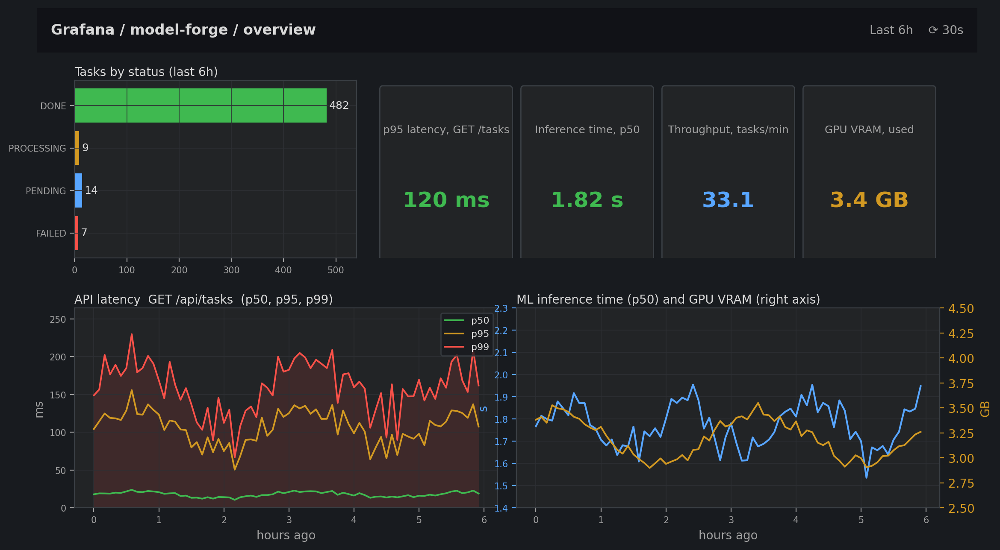

# Программная реализация платформы

<!--
Цель главы: показать что архитектурные решения из главы 3 воплощены в коде.
Объём: 10-12 страниц (~3000-3500 слов).
ИСТОЧНИК: реальный код в D:/model-forge/{frontend, kotlin-service, ml-service, deploy}.
Ссылаться на конкретные файлы (например, ml-service/src/modelforge/ml/triposr_inference.py).
-->

## Frontend: React-приложение

Веб-клиент платформы model-forge реализован как одностраничное приложение на библиотеке React и собирается инструментом Vite (см. `frontend/package.json`, `frontend/vite.config.js`). Среди прикладных зависимостей — клиент HTTP-запросов `axios`, маршрутизатор `react-router-dom` и компонент `@google/model-viewer` для отображения трёхмерных моделей в форматах GLB и GLTF средствами браузерных API WebGL. Исходный код организован в типовую для React-приложений структуру каталогов в директории `frontend/src/`: `pages/` — экранные представления, привязанные к маршрутам; `components/` — переиспользуемые элементы интерфейса; `hooks/` — пользовательские React-хуки, инкапсулирующие связное поведение; `context/` — провайдеры глобального состояния; `api/` — обёртки над HTTP-клиентом; `utils/` — общие утилиты и константы.

Маршрутизация описана декларативно в файле `frontend/src/App.jsx`: открытые маршруты `/login` и `/register` доступны без аутентификации, а группа закрытых маршрутов (`/dashboard`, `/tasks/new`, `/tasks/:id`, `/analytics`, `/settings`) защищена компонентом `ProtectedRoute`. Состояние аутентификации хранится в провайдере `AuthContext` (`frontend/src/context/AuthContext.jsx`), а токен JWT прозрачно подставляется в заголовок `Authorization` через интерсептор axios (`frontend/src/api/axios.js`). Такая организация выносит работу с токенами из бизнес-кода страниц и обеспечивает единообразную обработку истёкшей сессии: при ответе сервера с кодом 401 пользователь автоматически перенаправляется на страницу входа.

Взаимодействие с REST API инкапсулировано в модуле `frontend/src/api/`, где каждый функциональный домен — задачи, аутентификация, настройки — описан отдельным файлом с функциями, формирующими типизированные по контракту запросы (`tasks.js`, `auth.js`, `settings.js`). Это даёт единственную точку модификации при изменении контракта серверной части и упрощает регрессионное сопоставление с OpenAPI-спецификацией. Ошибки сетевого взаимодействия проходят через универсальный обработчик в хуке `useAsync` (`frontend/src/hooks/useAsync.js`), извлекающий читаемое сообщение из ответа сервера или, при его отсутствии, использующий общее сообщение о сбое.

Ключевой особенностью пользовательского сценария является длительность инференса (от единиц до десятков секунд), что требует отображения текущего прогресса задачи в режиме, близком к реальному времени. В платформе применён режим периодического опроса серверного состояния (long-polling), реализованный в хуке `useTaskPolling` (`frontend/src/hooks/useTaskPolling.js`). При монтировании компонента детального просмотра задачи хук немедленно запрашивает текущее состояние через функцию `getTask`, а затем устанавливает таймер `setInterval` с интервалом, заданным константой `POLLING_INTERVAL_MS` (`frontend/src/utils/constants.js`); при достижении задачей терминальных статусов `COMPLETED` или `FAILED` интервал автоматически прекращается, что исключает излишнюю нагрузку на API-сервис. Альтернативные механизмы — Server-Sent Events и WebSocket — обеспечили бы меньшую задержку обновления, однако потребовали бы поддержки длительных соединений в инфраструктуре API-сервиса и усложнили бы балансировку нагрузки; для типовой длительности инференса в десятки секунд периодический опрос признан достаточным компромиссом.

После перехода задачи в состояние `COMPLETED` интерфейс активирует загрузку готовой 3D-модели. Хук `useModelDownload` (`frontend/src/hooks/useModelDownload.js`) запрашивает у API-сервиса бинарный артефакт, разбирает многочастный ответ типа `multipart/form-data` (утилита `parseMultipartResponse` в `frontend/src/utils/multipart.js`), формирует объект `Blob` и публикует временную ссылку через вызов `URL.createObjectURL`. Полученная ссылка одновременно подаётся в компонент `ModelViewer` (`frontend/src/components/ModelViewer.jsx`), оборачивающий `@google/model-viewer`, для интерактивного просмотра модели в окне браузера, и используется при ручном скачивании через якорный элемент с атрибутом `download`. Освобождение ресурсов выполняется через `URL.revokeObjectURL` при размонтировании компонента, что исключает утечки памяти браузера при длительной работе с приложением.

Рисунок 4 – Скриншот главного экрана веб-клиента: список задач пользователя с фильтрацией по статусу

Список задач пользователя реализован в компоненте `Dashboard` (`frontend/src/pages/Dashboard.jsx`) с поддержкой страничной разбивки и фильтрации по статусу через хук `useTasks` (`frontend/src/hooks/useTasks.js`); параметры запроса передаются на сервер и обрабатываются на стороне `kotlin-service`. Стилевое оформление основано на собственном наборе компонентов (`GlassCard`, `Button`, `LoadingSpinner`, `Pagination`, `StatusBadge`), что обеспечивает визуальную связность интерфейса без подключения сторонних библиотек компонентов и сокращает размер итогового бандла, доставляемого пользователю.

## Kotlin Backend: Spring Boot REST API

API-сервис платформы реализован на языке Kotlin поверх фреймворка Spring Boot. Исходный код располагается в каталоге `kotlin-service/src/main/kotlin/com/modelforge/`. Состав внешних зависимостей зафиксирован в файле `kotlin-service/build.gradle.kts` и включает стартеры Spring Boot для веб-слоя (`spring-boot-starter-web`), безопасности (`spring-boot-starter-security`), доступа к данным (`spring-boot-starter-jdbc`), валидации (`spring-boot-starter-validation`) и публикации эксплуатационных эндпоинтов (`spring-boot-starter-actuator`). Интеграция с брокером сообщений выполняется через `spring-kafka`, миграции базы — через `liquibase-core`, аутентификация — через библиотеку `jjwt`, объектное хранилище — через нативный клиент `io.minio:minio:8.5.7`, описание контракта — через `springdoc-openapi-starter-webmvc-ui`. Применение JDBC вместо JPA является осознанным решением: при простой реляционной модели накладные расходы и непрозрачность управления сессией Hibernate не оправдываются, тогда как явные запросы на SQL обеспечивают предсказуемость и упрощают отладку производительности [21].

Внутренняя организация модуля следует слоистой архитектуре «контроллер → сервис → репозиторий» с разделением сущностей предметной области (`entity/`), объектов передачи данных (`dto/`), специализированных исключений (`exception/`), компонентов безопасности (`security/`) и конфигурационных классов (`config/`). Внедрение зависимостей выполняется конструкторно через средства Spring, что обеспечивает явность связей между компонентами и упрощает их подмену в тестах [16].

### Слой контроллеров и REST API

Слой контроллеров расположен в каталоге `kotlin-service/src/main/kotlin/com/modelforge/controller/` и включает классы `AuthController` (регистрация и вход), `TaskController` (управление задачами генерации), `SettingsController` (динамические настройки воркера), `HealthController` (готовность сервиса) и `GlobalExceptionHandler` (централизованное преобразование исключений в HTTP-ответы). Эндпоинты задач сосредоточены в `TaskController.kt` под общим префиксом `/api/tasks`; их перечень и назначение приведены в таблице 4.

Таблица 4 – Перечень REST-эндпоинтов API-сервиса для управления задачами генерации

| Метод и путь | Назначение | Тело запроса | Тело ответа |
|---|---|---|---|
| `POST /api/tasks` | Создать задачу на генерацию 3D-модели | `multipart/form-data`: `file`, `prompt` | `TaskResponse` (201 Created) |
| `GET /api/tasks/{id}` | Получить задачу по идентификатору | — | `TaskResponse` |
| `GET /api/tasks` | Получить страницу задач пользователя с фильтрацией | параметры `page`, `size`, `status` | `PagedResponse<TaskResponse>` |
| `GET /api/tasks/{id}/metrics` | Получить метрики качества генерации | — | `GenerationMetricsResponse` |
| `GET /api/tasks/{id}/download` | Скачать сгенерированный 3D-файл с метаданными | — | `multipart/form-data` (метаданные + бинарный файл) |
| `GET /api/tasks/with-metrics` | Получить задачи с метриками для аналитического экрана | параметры `page`, `size`, `status` | `PagedResponse<TaskWithMetricsResponse>` |
| `GET /api/tasks/analytics/summary` | Сводные показатели пользователя | — | `TaskAnalyticsSummaryResponse` |
| `GET /api/tasks/analytics/timeline` | Распределение задач по дням за период | параметр `days` | `TaskTimelineResponse` |

Контракт каждого эндпоинта документирован средствами библиотеки `springdoc-openapi`: аннотации `@Tag`, `@Operation`, `@ApiResponses`, `@Schema` на методах контроллера автоматически порождают спецификацию OpenAPI 3.1, доступную по адресу `/v3/api-docs`, и интерактивный обозреватель Swagger UI. Это обеспечивает согласованность серверной реализации и описания контракта без дополнительных шагов сборки и упрощает кодогенерацию клиентских библиотек.

Валидация входных параметров выполняется на двух уровнях. Структурные ограничения — типы параметров запроса и пути, обязательность мультипартных частей, диапазоны числовых параметров — обеспечивает встроенный механизм связывания запроса. Бизнес-правила, требующие доступа к контексту приложения, реализованы в сервисном слое: в `TaskService.validateFile` ограничивается размер загружаемого файла (10 МБ) и проверяется допустимость расширения (`jpg`, `jpeg`, `png`, `webp`); при нарушении выбрасывается доменное исключение `InvalidFileException`, преобразуемое в код 400 в `GlobalExceptionHandler`.

### Аутентификация и безопасность

Защита эндпоинтов основана на токенах JWT, генерируемых сервисом `JwtService` и обрабатываемых фильтром в подсистеме безопасности (`kotlin-service/src/main/kotlin/com/modelforge/security/`). Открытыми оставлены только эндпоинты `/api/auth/register` и `/api/auth/login`; для остальных требуется заголовок `Authorization: Bearer <token>`. Идентификатор пользователя извлекается из аутентифицированного объекта `Authentication` в каждом обработчике, что исключает возможность чтения чужих задач посредством подмены параметра запроса: проверка владения задачей выполняется в `TaskService` и при несовпадении выбрасывает `TaskAccessDeniedException` (код 403). Хеширование паролей при регистрации выполняется штатным средством `BCryptPasswordEncoder`.

### Слой сервисов и Transactional Outbox

Бизнес-логика сосредоточена в каталоге `service/`. Центральный класс `TaskService` (`kotlin-service/src/main/kotlin/com/modelforge/service/TaskService.kt`) реализует операцию создания задачи как транзакцию (`@Transactional`), внутри которой выполняются: валидация файла, выгрузка содержимого в MinIO с детерминированным ключом `uploads/{uuid}.{ext}`, вставка записи в таблицу `tasks` через `TaskRepository` и формирование события `TASK_CREATED` в таблице `outbox_events` через `OutboxRepository`. Прямая отправка сообщения в Kafka в этой транзакции отсутствует — её выполняет фоновый компонент `OutboxScheduler` (см. раздел «Контракты сообщений Kafka» главы, посвящённой проектированию архитектуры). Такое разделение реализует паттерн Transactional Outbox [19] и гарантирует, что либо в реляционной базе и брокере появятся согласованные изменения, либо ни в одном из них.

Сервис `MinioService` инкапсулирует операции с объектным хранилищем через нативный клиент MinIO Java SDK: загрузку файлов, скачивание по ключу, проверку существования. Отдельно реализована операция выдачи скачивания в виде multipart-ответа (`TaskController.downloadTask`), которая объединяет в одном HTTP-ответе блок метаданных в формате JSON (`task_id`, `format`, `generated_at`) и бинарное содержимое 3D-модели; это исключает необходимость двух отдельных запросов от веб-клиента и упрощает обработку «результата задачи как единого артефакта». Сервис `AuthService` выполняет регистрацию и аутентификацию с выдачей JWT, а `OutboxScheduler` и `OutboxCleanupScheduler` — фоновую публикацию событий и периодическую очистку устаревших записей из таблицы `outbox_events` соответственно.

### Слой репозиториев и работа с PostgreSQL

Репозитории (`repository/`) реализованы поверх `JdbcTemplate` Spring Data JDBC: классы `TaskRepository`, `UserRepository`, `OutboxRepository`, `GenerationMetricsRepository`, `AppSettingsRepository`. Каждый репозиторий содержит явные SQL-запросы, упорядоченные по сценариям применения (поиск задачи по идентификатору и владельцу, постраничный список по фильтрам, обновления статусов с инкрементированием `updated_at`, агрегация по дням для аналитики). Пул соединений с PostgreSQL обеспечивается включённым по умолчанию в Spring Boot пулом HikariCP. Эволюция схемы базы данных описывается в каталоге `kotlin-service/src/main/resources/db/changelog/` в виде SQL-журналов изменений Liquibase, которые применяются автоматически при старте приложения (см. раздел «Схема данных» главы, посвящённой проектированию архитектуры).

### Обработка ошибок

Глобальная обработка исключений вынесена в `GlobalExceptionHandler` с использованием механизма `@RestControllerAdvice`. Доменные исключения (`TaskNotFoundException` → 404, `TaskAccessDeniedException` → 403, `TaskNotCompletedException` → 409, `InvalidFileException` → 400) преобразуются в типизированные тела ответов `ErrorResponse` с описательным сообщением; непредусмотренные ошибки логируются и возвращаются в обобщённом виде с кодом 500. Такое решение даёт единообразный контракт ошибок для веб-клиента и согласуется с описанной OpenAPI-спецификацией.

## ML Worker: Python и интеграция с TripoSR

ML-воркер платформы model-forge реализован как фоновое приложение на языке Python, основная роль которого — потребление заданий из топика Apache Kafka и выполнение инференса модели 3D-реконструкции TripoSR [7]. Исходный код размещён в каталоге `ml-service/src/modelforge/` и организован по принципу разделения ответственности на изолированные модули: `worker/` — точка входа и главный цикл, `kafka/` — клиент брокера и контракты сообщений, `tasks/` — пайплайн обработки задачи, `ml/` — абстракция над моделью и её реализации, `preprocessing/` — подготовка изображения, `storage/` — клиент S3-совместимого хранилища, `database/` — репозиторий PostgreSQL, `metrics/` — счётчики Prometheus и расчёт качества меша, `config/` — настройки и журналирование, `finetuning/` — компоненты дообучения. Композиция компонентов осуществляется в классе `App` (`ml-service/src/modelforge/worker/app.py`) через внедрение зависимостей в конструкторе, что упрощает подмену реализаций в модульных тестах.

Главный цикл воркера построен поверх синхронного клиента `kafka-python` (`ml-service/src/modelforge/kafka/consumer.py`). При старте экземпляр класса `KafkaConsumerService` устанавливает соединение с брокером с автоматическим повторением при сбоях, подписывается на топик `modelforge.generation.requests` от лица consumer-группы `modelforge.ml-workers` и переходит в режим итерации по входящим сообщениям. Для каждого сообщения вызывается метод `App.run`, нормализующий формат полей (поддерживаются camelCase от Kotlin-сервиса и snake_case от устаревших клиентов), регистрирующий запись в таблице `tasks` со статусом `PENDING` и передающий нормализованный объект в `TaskProcessor`. Для корректного завершения по сигналам `SIGINT` и `SIGTERM` зарегистрированы обработчики, переводящие флаг работы цикла в ложное значение и закрывающие соединение с Kafka после обработки текущего сообщения; такая схема обеспечивает корректную обработку перезапуска без потери задач [21].

Пайплайн обработки одной задачи реализован в классе `TaskProcessor` (`ml-service/src/modelforge/tasks/processor.py`). Последовательность стадий и их назначение приведены на рисунке 5.

Рисунок 5 – Пайплайн обработки одной задачи в ML-воркере: от получения сообщения до записи результата

Перед каждой задачей выполняется проверка таблицы динамических настроек `app_settings`: если значения `ml_mock_mode` или `ml_device` изменены администратором через REST-эндпоинт настроек, инференс-сервис пересобирается фабричным методом без перезапуска процесса воркера. Это позволяет переключаться между mock-режимом и реальной моделью, а также между CPU и GPU, эксплуатационными средствами без участия системы оркестрации. Полезная нагрузка сообщения валидируется через Pydantic-модель `TaskRequest`; при ошибке валидации задача отмечается статусом `FAILED` с указанием причины, и обработка следующего сообщения продолжается без остановки воркера. После успешной валидации статус задачи переводится в `PROCESSING`, исходное изображение скачивается из MinIO по ключу `s3_path`, передаётся в препроцессор `ImagePreprocessor` (`ml-service/src/modelforge/preprocessing/pipeline.py`) и подаётся на вход модели.

Препроцессинг включает три этапа: проверку допустимых размеров изображения (от 64 до 8192 пикселей по обеим сторонам), удаление фона библиотекой `rembg` (опционально, по флагу `params.remove_background`) и приведение к квадратному формату с целевым разрешением 512×512 пикселей через ресайзинг с сохранением пропорций и заполнением альфа-каналом. Целевое разрешение задаётся настройкой `preprocess_image_size` и совпадает с входным разрешением, на котором обучалась авторская версия TripoSR [7], что обеспечивает совместимость инференса с предобученными весами.

Слой инференса абстрагирован за интерфейсом `ModelInferenceInterface` (`ml-service/src/modelforge/ml/inference_interface.py`) с двумя реализациями: `TripoSRService` для реального запуска модели и `MockInferenceService` для разработки и нагрузочного тестирования. Выбор реализации делегирован фабрике `create_inference_service` в файле `ml-service/src/modelforge/ml/factory.py`: если включён mock-режим — возвращается `MockInferenceService` с настраиваемой задержкой; иначе фабрика подбирает устройство (`cuda:0` с автоматическим понижением до `cpu` при отсутствии GPU), при наличии указанной версии дообученной модели разрешает путь к чекпоинту через `WeightManager` и инициализирует `TripoSRService`. При сбое инициализации реальной модели (отсутствие зависимостей, ошибка загрузки весов) фабрика автоматически переходит в mock-режим, что обеспечивает стабильность воркера в условиях частичной готовности окружения. Применение паттерна «Стратегия» делает добавление новых моделей (например, LRM [12]) изменением, локализованным в `ml/` без вмешательства в код пайплайна.

Реализация `TripoSRService` (`ml-service/src/modelforge/ml/triposr_service.py`) загружает базовую модель `stabilityai/TripoSR` через библиотеку `tsr` авторов [7], переносит её на выбранное устройство, опционально применяет загруженные через `WeightManager` веса дообученного варианта (см. главу, посвящённую методике дообучения) и хранит в памяти процесса до завершения воркера. Инференс выполняется в три этапа: вычисление латентного представления изображения трансформером, экстракция меша алгоритмом маршевых кубов из неявного представления тройной плоскости (triplane) и экспорт результата в один из форматов `obj`, `glb`, `usdz`, `stl`, `ply`. Реализация `MockInferenceService` имитирует длительность инференса задержкой и возвращает фиксированный куб с фиктивными метриками; этот режим применяется при разработке инфраструктурных компонентов без участия графического ускорителя, а также при нагрузочном тестировании платформы.

После успешного инференса сгенерированный меш и текстура загружаются в MinIO по детерминированным ключам вида `results/{task_id}/model.{format}` и `results/{task_id}/texture.png`. Если включён сбор метрик качества (флаг `experiment_collect_metrics`), на меше вычисляются характеристики `chamfer_distance`, `iou_3d`, `f_score`, `normal_consistency`, число вершин и граней, время инференса (`compute_self_metrics` в `ml-service/src/modelforge/metrics/quality.py`), которые сохраняются в таблицу `generation_metrics` и параллельно — в виде JSON-файла `results/{task_id}/metrics.json` в MinIO для последующего автономного анализа. Завершающий шаг пайплайна — атомарное обновление таблицы `tasks`: статус переводится в `COMPLETED`, поле `s3_output_key` указывает на загруженный меш. При исключениях на любом этапе задача отмечается статусом `FAILED` с записью текста ошибки в поле `error_message`, увеличиваются счётчики Prometheus `tasks_processed{status=failed}` и `tasks_errors`, после чего воркер продолжает обработку следующего сообщения.

## Развёртывание

Развёртывание платформы реализовано на основе контейнеризации каждого сервиса и модульной композиции окружений через `docker-compose` [22]. Такой подход согласуется с принципами «двенадцатифакторного приложения» [26], которые требуют единого артефакта сборки, конфигурации через переменные окружения и поведенческой эквивалентности dev- и prod-окружений. Применение контейнеризации позволяет удовлетворить нефункциональное требование переносимости (запуск платформы на ноутбуке разработчика без предустановки JVM, Python, PostgreSQL и MinIO), сформулированное в главе анализа требований, а модульность compose-описаний — отделить конфигурацию инфраструктуры от конфигурации приложения и аппаратно-зависимых настроек ML-воркера.

### Контейнеризация

Каждый сервис платформы поставляется в виде самостоятельного образа с собственным `Dockerfile` (`frontend/Dockerfile`, `kotlin-service/Dockerfile`, `ml-service/Dockerfile`, `ml-service/Dockerfile.seed`). Для веб-клиента и серверной части на Kotlin применяется техника многоступенчатой сборки (multi-stage build) [22]: на первом этапе используется тяжёлый образ с инструментарием (Node.js + npm для React-приложения, JDK + Gradle для Spring Boot), на втором — копируются только артефакты сборки в минимальный runtime-образ (`nginx:alpine` для статики и `eclipse-temurin:21-jre-alpine` для JVM). Эта схема сокращает итоговый размер образа в несколько раз и снижает поверхность атаки, так как в финальный образ не попадают компиляторы и менеджеры пакетов.

Для образа ML-воркера используется параметризация через build-аргумент `MODE`, принимающий значения `mock`, `cpu` и `gpu`. В режимах `cpu` и `gpu` устанавливаются разные комбинации `torch` и `torchvision`, что позволяет хранить базовый `Dockerfile` единым, но получать на выходе образ, оптимизированный под конкретное аппаратное окружение. Для каждого контейнера в compose-описаниях заданы декларативные ограничения ресурсов (`mem_limit`, `cpus`, `shm_size`), политика рестарта (`restart: always` для сервисов с долгим жизненным циклом, `restart: "no"` для одноразовых job-ов вроде `minio-seed`) и параметры драйвера логирования `json-file` с ротацией (`max-size: 10m`, `max-file: 3`), что предотвращает неконтролируемый рост дисковой подсистемы хоста. Метка `logging=promtail` на каждом сервисе используется агентом сбора логов для фильтрации потоков (см. подраздел «Логирование»). Для зависимостей от инфраструктурных сервисов применяется механизм `depends_on` с условием `service_healthy`, опирающимся на встроенные `healthcheck`-инструкции инфраструктурных образов; это предотвращает запуск приложения до полной готовности PostgreSQL, Kafka и MinIO.

### Локальное развёртывание

Конфигурация развёртывания вынесена в каталог `deploy/` и разделена на восемь compose-файлов, каждый из которых описывает изолированный аспект окружения. Корневой файл `docker-compose.yml` определяет только сетевой контур `modelforge-net` (драйвер `bridge`) и именованные тома (`postgres_data`, `minio_data`, `loki_data`, `grafana_data`, `prometheus_data`); сервисы размещены в отдельных файлах согласно функциональному назначению (см. таблицу 5). Композиция нужного окружения выполняется через многократное указание флага `-f`, что является штатным механизмом Docker Compose для реализации overlay-композиций [22] и позволяет переиспользовать одно и то же описание сервиса в нескольких профилях развёртывания без дублирования.

Таблица 5 – Перечень compose-файлов и их назначение

| Файл                              | Назначение                                                                       |
| --------------------------------- | -------------------------------------------------------------------------------- |
| `docker-compose.yml`              | Сеть и общие тома платформы                                                      |
| `docker-compose.infra.yml`        | Инфраструктура: PostgreSQL, MinIO, ZooKeeper, Kafka                              |
| `docker-compose.app.yml`          | ML-воркер в mock-режиме и one-off задача `minio-seed`                            |
| `docker-compose.kotlin.yml`       | API-сервис на Spring Boot                                                        |
| `docker-compose.frontend.yml`     | Веб-клиент на React (раздаётся через `nginx`)                                    |
| `docker-compose.cpu-inference.yml`| Overlay для запуска TripoSR на CPU                                               |
| `docker-compose.gpu.yml`          | Overlay для запуска TripoSR на NVIDIA GPU (требует `nvidia-container-toolkit`)   |
| `docker-compose.logging.yml`      | Стек агрегации логов: Loki, Promtail, Grafana                                    |
| `docker-compose.monitoring.yml`   | Стек метрик: Prometheus, postgres-exporter                                       |

В платформе предусмотрены три типовых профиля развёртывания. Профиль разработки объединяет инфраструктуру, ML-воркер в mock-режиме и API-сервис, не требует наличия GPU и применяется для интеграционного тестирования всех слоёв за исключением реального инференса. Профиль локального инференса дополнительно подключает overlay `cpu-inference.yml` и стек логирования; он используется при разработке функций, чувствительных к реальному времени обработки, на машине без графического ускорителя. Профиль, приближенный к продуктивному, добавляет overlay `gpu.yml`, веб-клиент и стек мониторинга и применяется при экспериментальном исследовании производительности (см. главу, посвящённую экспериментам). Параметризация всех значимых настроек (порты, имена баз и топиков, лимиты ресурсов, режимы инференса) осуществляется через переменные окружения, шаблон которых задан в файле `deploy/.env.example`; конкретные значения хранятся в `deploy/.env` и не попадают в систему контроля версий, что соответствует принципу разделения кода и конфигурации [26].

### Готовность к продакшен-развёртыванию

Архитектурные решения, принятые на этапе реализации, обеспечивают применимость описанной конфигурации не только в стенде разработчика, но и в продуктивном окружении. Все сервисы, обрабатывающие пользовательские запросы (`kotlin-service`, `ml-worker`, `frontend`), не хранят локального состояния между запросами — состояние делегировано PostgreSQL, MinIO и Kafka, — что позволяет масштабировать их горизонтально путём увеличения числа реплик [18]. Конфигурация подаётся через переменные окружения, что согласуется с третьим принципом «двенадцатифакторного приложения» [26] и позволяет управлять одной и той же сборкой образа в разных окружениях. Каждый сервис экспонирует HTTP-эндпоинт проверки работоспособности: `GET /actuator/health` для API-сервиса (стандартный механизм Spring Boot Actuator) и `GET /metrics` для ML-воркера; эти эндпоинты используются как `healthcheck` на уровне Docker и могут быть переиспользованы в качестве `livenessProbe` и `readinessProbe` при миграции на Kubernetes. Поскольку существующие compose-описания используют только стандартные примитивы (`services`, `volumes`, `networks`, `depends_on`, `deploy.resources`), для перехода на оркестрацию Kubernetes достаточно автоматизированного преобразования утилитой `kompose`, после чего объекты `Deployment`, `StatefulSet` (для постоянных томов), `Service` и `ConfigMap` могут быть доработаны вручную в соответствии с принятыми в целевом кластере политиками.

## Логирование и мониторинг

Подсистема наблюдаемости платформы построена на основе двух независимых стеков: стека агрегации логов на базе Grafana Loki [23] и стека метрик на базе Prometheus [24], объединённых единым визуализационным фронтендом Grafana [25]. Такое разделение соответствует общепринятой модели наблюдаемости с тремя сигналами (логи, метрики, трассировки) [21] и позволяет независимо масштабировать каждый стек по объёму данных, а также подключать или отключать его в зависимости от выбранного профиля развёртывания.

### Логирование

Все компоненты платформы (API-сервис, ML-воркер, веб-клиент) пишут структурированные JSON-логи в стандартный поток вывода контейнера. Формат логирования управляется переменной окружения `LOG_FORMAT` (значение `json` для агрегации, `text` для локальной разработки), а уровень — переменной `LOG_LEVEL`. Для каждого события записывается имя сервиса (`SERVICE_NAME`), окружение (`ENVIRONMENT`), версия (`APP_VERSION`) и идентификатор корреляции, прокидываемый между сервисами в заголовке `X-Correlation-Id` для прослеживания пути запроса от веб-клиента через API-сервис и Kafka до ML-воркера.

Сбор логов выполняется агентом `Promtail` версии 2.9.2 (`deploy/docker-compose.logging.yml`), который монтирует в режиме «только чтение» каталог `/var/lib/docker/containers` и сокет Docker, обнаруживает контейнеры с меткой `logging=promtail` и пересылает их потоки в Loki. Хранилище Loki той же версии 2.9.2 используется в однонодовой конфигурации с томом `loki_data`, что достаточно для отладки и нагрузочного тестирования, но при переходе в продуктивное окружение может быть заменено на распределённую установку без изменения конфигурации источников. Просмотр логов производится в Grafana через встроенный плагин `grafana-lokiexplore-app`, что позволяет фильтровать поток по имени сервиса, уровню и идентификатору корреляции и сопоставлять записи логов с метриками Prometheus в одном временном окне.

### Мониторинг

Сбор метрик выполняется Prometheus версии 2.47.0 (`deploy/docker-compose.monitoring.yml`) с заданным сроком хранения `7d` и периодическим скрейпингом эндпоинтов `/metrics` ML-воркера и `/actuator/prometheus` API-сервиса. Дополнительно подключён `postgres-exporter`, экспонирующий технические метрики базы данных (число соединений, задержки запросов, размер таблиц), что важно для оценки влияния планировщика `Transactional Outbox` на нагрузку. Конфигурация сборщика и правил алертинга вынесена в `monitoring/prometheus/prometheus.yml` и `monitoring/prometheus/alerts.yml` соответственно.

Визуализация осуществляется в Grafana 10.2.3, источники данных Loki и Prometheus подключаются автоматически через механизм `provisioning` (каталог `logging/grafana/provisioning`), что обеспечивает воспроизводимость конфигурации при пересоздании контейнера. Базовый дашборд платформы (рисунок 7) объединяет ключевые показатели: число задач в очереди по статусам, среднее и 95-й процентиль времени инференса, доля успешно завершённых задач, нагрузка на CPU и память контейнеров, число активных соединений с PostgreSQL. Использование одного фронтенда для логов и метрик позволяет дежурному инженеру за один переход от метрики «доля ошибок» перейти к соответствующим записям логов конкретного сервиса, что сокращает время локализации проблемы.

Рисунок 7 – Скриншот сводного дашборда Grafana: статусы задач, латентность инференса и базовые метрики ресурсов
