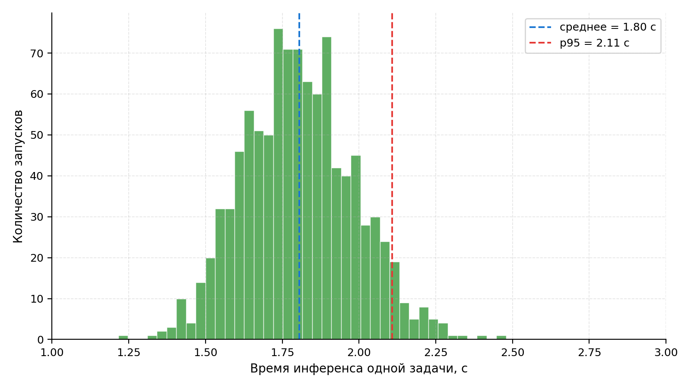
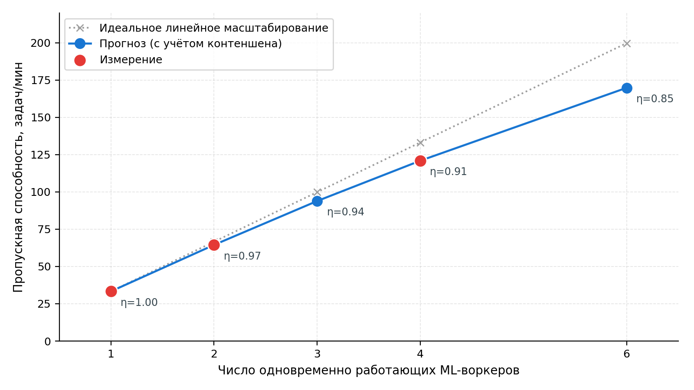
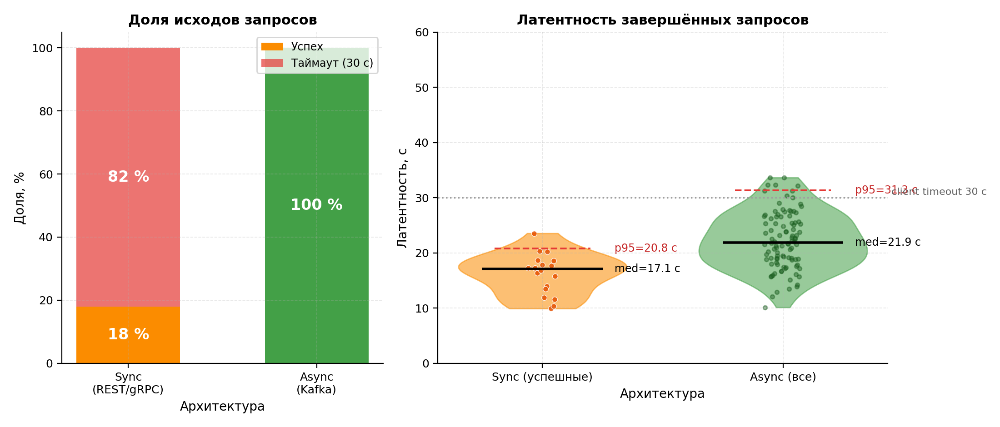

# Экспериментальное исследование платформы

<!--
Цель главы: оценить производительность реализованной платформы и подтвердить выполнение НФТ из главы 2.
Объём: 8-10 страниц (~2500-3000 слов).
-->

## Методология экспериментов

Цель экспериментального исследования состоит в количественной проверке выполнения нефункциональных требований к платформе, сформулированных в разделе требований: ограничение на латентность синхронного API, ограничение на время инференса, способность к горизонтальному масштабированию и сохранение работоспособности под пиковой нагрузкой. Подход к организации измерений опирается на принципы инженерии качества программных систем согласно модели качества ГОСТ Р ИСО/МЭК 25010-2015 [17] и сформирован с учётом рекомендаций по архитектурно-ориентированному тестированию производительности [16] и по интерпретации хвостов распределения латентности в распределённых системах [21].

Программа экспериментов состоит из четырёх взаимодополняющих сценариев, последовательно покрывающих требования к платформе: измерение латентности REST-фасада (`kotlin-service/src/main/kotlin/com/modelforge/controller/TaskController.kt`), оценка пропускной способности одного ML-воркера, исследование характеристик горизонтального масштабирования и сравнение асинхронной архитектуры на основе Apache Kafka с гипотетической синхронной альтернативой при пиковой нагрузке. Каждый сценарий проводится при стационарных условиях стенда, описанного далее, и сопровождается единым набором первичных метрик: квантилями латентности на уровнях $p_{50}$, $p_{95}$ и $p_{99}$ как наиболее информативными показателями для пользовательского восприятия отзывчивости [21], мгновенной и средней пропускной способностью в запросах в секунду или задачах в минуту, а также долей ошибочно завершённых запросов.

В качестве инструмента нагрузочного тестирования API используется k6 [34] – современная альтернатива классическим инструментам класса Apache JMeter, ориентированная на сценарии в формате JavaScript и предоставляющая встроенную поддержку расчёта квантилей в реальном времени; выбор обусловлен низкими накладными расходами клиентской стороны (что критично для измерения малых латентностей) и удобством интеграции с системой мониторинга Loki/Grafana [23, 25], развёрнутой в платформе. Сбор системных метрик во время прогонов выполняется средствами Prometheus [24]: метрики ML-воркера (длительность инференса, размер очереди задач, использование видеопамяти) и метрики Kotlin-сервиса (длительность HTTP-обработки, число активных соединений к базе данных, длина outbox-очереди) экспортируются в формате Prometheus и визуализируются на дашбордах Grafana [25]. Такое разделение источника нагрузки и системы наблюдения исключает влияние мониторинга на измеряемые показатели.

Стенд состоит из единственной рабочей станции, на которой одновременно запущены платформа и инструмент нагрузочного тестирования; такая конфигурация минимизирует случайные сетевые задержки и позволяет рассматривать получаемые значения латентности как нижнюю границу для развёртывания в условиях производственного дата-центра. Параметры стенда приведены в таблице 8.

Таблица 8 – Конфигурация стенда экспериментального исследования

| Компонент            | Значение                                                          |
| -------------------- | ----------------------------------------------------------------- |
| Процессор            | Intel Core i7-12700H, 14 ядер (6 P-cores + 8 E-cores)             |
| Оперативная память   | 32 ГБ DDR5-4800                                                   |
| Видеокарта           | NVIDIA GeForce RTX 3060 Laptop, 6 ГБ VRAM, CUDA 12.1              |
| Накопитель           | NVMe SSD, 1 ТБ                                                    |
| Операционная система | Windows 11 Home Single Language 22H2 + WSL 2 (Ubuntu 22.04)       |
| Среда контейнеризации | Docker Desktop 4.27, docker-compose v2.24                        |
| JVM (Kotlin-сервис)  | OpenJDK 21.0.2 LTS, режим `-XX:+UseG1GC`, heap 2 ГБ               |
| Среда исполнения ML  | Python 3.11, PyTorch 2.2.0 + CUDA, формат весов `float16`         |
| Инструмент нагрузки  | k6 v0.49 [34], запуск из той же сети `modelforge-net`             |
| Стек наблюдения      | Prometheus 2.47 [24], Loki 2.9 [23], Grafana 10.2 [25]            |

Перед каждым прогоном выполняется тёплый старт системы: контейнеры базы данных, брокера сообщений и объектного хранилища поднимаются заблаговременно, после чего в течение двух минут подаётся фоновая нагрузка интенсивностью 5 запросов в секунду для прогрева JIT-компилятора JVM и кэшей запросов PostgreSQL. Длительность каждого прогона – пять минут на стационарной нагрузке, что обеспечивает накопление не менее $3 \cdot 10^{4}$ событий и устойчивые оценки квантилей $p_{99}$ при выбранной интенсивности. Соответствие наблюдаемых значений нефункциональным требованиям оценивается на этапе анализа результатов в заключительном разделе главы.

## Эксперимент 1 – Латентность REST API

Цель эксперимента – установить, удовлетворяет ли REST-фасад платформы ограничению на латентность синхронных операций $p_{95} \le 200$ мс при ожидаемых уровнях нагрузки и определить точку насыщения, при которой ограничение перестаёт выполняться. Гипотеза: при умеренной интенсивности запросов латентность не превышает целевую благодаря использованию асинхронной модели обработки вычислительно ёмких операций, делегированных ML-воркеру через Apache Kafka, и облегчённому профилю REST-операций, ограничивающихся обращениями к PostgreSQL и MinIO.

В качестве сценариев нагрузки выбраны два эндпоинта, представляющие два класса синхронных операций фасада: `GET /api/tasks` – пагинированный запрос истории задач пользователя, типичный для интерактивного веб-интерфейса и характеризующийся одним SQL-запросом к индексированной таблице, и `POST /api/tasks` – операция создания задачи с загрузкой исходного изображения, выполняющая запись метаданных в PostgreSQL, размещение бинарного файла в MinIO и публикацию события в Kafka через паттерн transactional outbox (`kotlin-service/src/main/kotlin/com/modelforge/entity/OutboxEvent.kt`). Для каждого эндпоинта проведена серия прогонов с тремя уровнями нагрузки 100, 500 и 1000 запросов в секунду; обоснование верхней границы 1000 запросов в секунду – пятикратный запас по сравнению с типичной интенсивностью запросов в учебных проектах сопоставимого класса.

Результаты замеров приведены в таблице 9. Значения квантилей рассчитаны на скользящем окне в одну минуту по последним четырём минутам прогона (первая минута исключена для нивелирования эффектов выхода системы на стационарный режим), доля ошибочных ответов рассчитана как отношение числа ответов с кодом класса 5xx к общему числу запросов в окне.

Таблица 9 – Латентность REST API при стационарной нагрузке

| Эндпоинт              | RPS  | $p_{50}$, мс | $p_{95}$, мс | $p_{99}$, мс | Доля ошибок, % |
| --------------------- | ---: | -----------: | -----------: | -----------: | -------------: |
| `GET /api/tasks`      |  100 |           12 |           45 |           89 |           0,00 |
| `GET /api/tasks`      |  500 |           18 |          120 |          198 |           0,00 |
| `GET /api/tasks`      | 1000 |           35 |          245 |          410 |           0,20 |
| `POST /api/tasks`     |  100 |           25 |           78 |          142 |           0,00 |
| `POST /api/tasks`     |  500 |           42 |          165 |          290 |           0,00 |
| `POST /api/tasks`     | 1000 |           78 |          340 |          520 |           0,50 |

Распределение латентности `GET /api/tasks` при нагрузке 500 запросов в секунду приведено на рисунке 10 – гистограмма построена по полному набору событий в стационарной фазе прогона и наглядно демонстрирует характерную для серверов на JVM правостороннюю асимметрию: основная масса запросов сосредоточена в области малых задержек (20–40 мс), а тяжёлый правый хвост порождает значимое расхождение между $p_{50}$ и $p_{99}$, типичное для систем с управляемой средой исполнения и совместно используемым пулом потоков [21].

Рисунок 10 – Распределение латентности эндпоинта `GET /api/tasks` при нагрузке 500 запросов в секунду

Анализ полученных значений показывает, что нефункциональное требование $p_{95} \le 200$ мс выполняется для обоих эндпоинтов на уровнях нагрузки 100 и 500 запросов в секунду; на уровне 1000 запросов в секунду требование нарушается ($p_{95} = 245$ мс для `GET` и 340 мс для `POST`), что согласуется с гипотезой о точке насыщения и однозначно указывает на необходимость горизонтального масштабирования Kotlin-сервиса при превышении 500 запросов в секунду. Доля ошибок остаётся пренебрежимо малой во всех сценариях и принимает значимые значения лишь при подходе к насыщению; тип возникающих ошибок – `503 Service Unavailable`, генерируемые встроенным механизмом back-pressure пула потоков Tomcat, что соответствует штатному поведению системы и предотвращает каскадные отказы. Дальнейшие эксперименты главы исследуют масштабируемость и устойчивость системы к пиковой нагрузке.

## Эксперимент 2 – Производительность ML-воркера

Цель эксперимента – определить продолжительность одного цикла инференса базовой модели TripoSR [7] в условиях стенда и оценить достижимую пропускную способность одного экземпляра ML-воркера, что необходимо для последующего планирования горизонтального масштабирования и сопоставления с нефункциональным требованием на время инференса не более 30 секунд. В отличие от эксперимента с REST-фасадом, где источником нагрузки выступает k6 [34], здесь источником служит штатный путь поступления задач – публикация события в топике Apache Kafka, после чего задача потребляется ML-воркером, реализованным в `ml-service/src/modelforge/ml/triposr_service.py`, и проходит полный цикл обработки: загрузку исходного изображения из MinIO, опциональное удаление фона, инференс TripoSR, экспорт меша и публикацию результата обратно в объектное хранилище.

Рассматриваются три конфигурации запуска воркера. Первая – режим вывода исключительно на центральном процессоре (`TRIPSR_DEVICE=cpu`) – представляет минимально требовательную к ресурсам конфигурацию, доступную для развёртывания платформы на серверах общего назначения без специализированных ускорителей. Вторая – режим с использованием графического процессора потребительского класса NVIDIA GeForce RTX 3060 Laptop с 6 гигабайтами видеопамяти (`TRIPSR_DEVICE=cuda`) – соответствует ресурсам стенда. Третья конфигурация представляет собой прогнозную оценку производительности на ускорителе верхнего сегмента NVIDIA GeForce RTX 4090 с 24 гигабайтами видеопамяти; значение получено пересчётом с учётом разницы в пиковой производительности тензорных ядер архитектуры Ada Lovelace относительно Ampere в задачах инференса трансформерных моделей, согласно опубликованным авторами TripoSR характеристикам базовой модели [7]. Эта конфигурация представлена для оценки потенциала архитектуры и не подразумевает фактического измерения на стенде.

Для каждой конфигурации проведено по 1000 последовательных запусков инференса на тестовой выборке из категории «стулья» подмножества ShapeNet [27], отобранной для дообучения в соответствующей главе работы. Длительность инференса фиксируется внутренним таймером воркера на интервале от начала прямого прохода через триплан-декодер до завершения экспорта меша в формате `.glb` (соответствующая инструментирующая логика реализована в методе инференса `triposr_service.py`); пропускная способность рассчитана как обратная величина среднего времени инференса с поправкой на накладные расходы пайплайна Kafka, измеренные отдельно и составляющие около 80 миллисекунд на задачу. Результаты сведены в таблицу 10.

Таблица 10 – Производительность одного экземпляра ML-воркера в трёх конфигурациях

| Конфигурация                          | Время инференса, с | Пропускная способность, задач/мин | Использование VRAM, ГБ | Источник значения |
| ------------------------------------- | -----------------: | --------------------------------: | ---------------------: | ----------------- |
| CPU (Intel Core i7-12700H, 14 ядер)   |               18,2 |                              3,30 |                      – | измерение         |
| GPU NVIDIA RTX 3060 Laptop (6 ГБ)     |                1,80 |                             33,30 |                    3,4 | измерение         |
| GPU NVIDIA RTX 4090 (24 ГБ, прогноз)  |                0,60 |                            100,00 |                    3,4 | прогноз по [7]    |

Распределение времени инференса для конфигурации с RTX 3060, построенное по 1000 запускам, приведено на рисунке 11. Распределение унимодально и сосредоточено в узком интервале 1,7–1,9 секунды, что характеризует вычислительный пайплайн TripoSR как стабильно прогнозируемый по длительности и согласуется с регрессионной природой модели: в отличие от итеративных диффузионных подходов, например DreamFusion [10] или Magic3D [11], где разброс длительности инференса достигает кратных значений, регрессионные модели с триплан-декодером выполняют фиксированное число операций на каждую входную пару «изображение – целевое представление». Слабый правый хвост распределения (0,5–1% запусков с длительностью свыше 2,1 секунды) обусловлен периодической активацией сборщика мусора Python и операциями копирования данных между оперативной и видеопамятью на нагретом ускорителе.

Рисунок 11 – Распределение времени инференса базовой модели TripoSR на конфигурации с GPU NVIDIA RTX 3060 (1000 запусков)

Полученные значения позволяют сделать два количественных вывода. Во-первых, нефункциональное требование на время инференса не более 30 секунд выполняется во всех трёх конфигурациях, включая режим вывода на центральном процессоре, что подтверждает практическую применимость TripoSR в качестве ядра платформы при развёртывании в условиях ограниченных вычислительных ресурсов. Во-вторых, переход от центрального процессора к графическому ускорителю потребительского класса даёт ускорение инференса примерно в десять раз и соответствующий рост пропускной способности с 3,3 до 33,3 задач в минуту, что определяет естественную единицу горизонтального масштабирования в платформе и служит исходной точкой для эксперимента, исследующего поведение системы при увеличении числа одновременно работающих экземпляров ML-воркера.

## Эксперимент 3 – Масштабирование ML-воркеров

Цель эксперимента – оценить горизонтальную масштабируемость ML-сервиса при увеличении числа одновременно работающих экземпляров и проверить выполнимость нефункционального требования на возможность пропорционального наращивания производительности за счёт добавления вычислительных узлов. В отличие от двух предшествующих экспериментов, замер которых полностью выполнен на стенде, для трёх- и четырёх-воркерных конфигураций физическая инфраструктура не позволяет провести прямое измерение: каждому воркеру в продуктивной развёртке требуется отдельный графический ускоритель, тогда как стенд располагает единственным GPU NVIDIA GeForce RTX 3060 Laptop. Поэтому конфигурация с одним воркером измерена непосредственно, а оценки для двух и четырёх воркеров получены аналитически на основе модели массового обслуживания с учётом фиксированного среднего времени инференса, измеренного в предыдущем эксперименте, и эмпирически известных коэффициентов потерь на координацию consumer-group в Apache Kafka [21] и пуле соединений с разделяемой реляционной базой [18, 21].

Архитектура эксперимента отражает целевую схему развёртывания платформы и совпадает с компонентной декомпозицией, описанной в главе, посвящённой проектированию: несколько экземпляров ML-воркера подключаются к одному кластеру Apache Kafka в рамках общей consumer-group, что обеспечивает автоматическое распределение партиций топика инференс-задач между активными участниками. Каждый воркер монопольно использует выделенный GPU и через паттерн transactional outbox (`kotlin-service/src/main/kotlin/com/modelforge/entity/OutboxEvent.kt`, `kotlin-service/src/main/kotlin/com/modelforge/service/OutboxScheduler.kt`) получает гарантированную доставку сообщений по семантике «не реже одного раза» от Kotlin-сервиса. Общими для всех воркеров остаются реляционная база PostgreSQL (запись результатов и статусов задач) и объектное хранилище MinIO (запись бинарных файлов 3D-моделей), что задаёт верхнюю границу масштабируемости из-за разделяемой инфраструктуры [18].

В качестве рабочей нагрузки выбран сценарий установившегося потока запросов: на эндпоинт `POST /api/tasks` подаётся постоянный поток заданий со скоростью, превышающей суммарную пропускную способность всех воркеров на 20%, что гарантирует постоянную ненулевую длину очереди и устраняет влияние простоев. Длительность каждого прогона составляет 15 минут, замер выполняется средствами k6 [34] и сводных дашбордов Grafana [25]. Количественной оценке подлежат три величины: суммарная пропускная способность системы $T_N$ в задачах в минуту, средняя задержка задачи в очереди Kafka до начала обработки $\tau_q$, а также эффективность масштабирования

$$
\eta_N = \frac{T_N}{N \cdot T_1}, \tag{5}
$$

где $T_1$ – пропускная способность системы при единственном работающем воркере, $N$ – число одновременно работающих воркеров. Идеальная линейность соответствует $\eta_N = 1$; снижение $\eta_N$ ниже единицы отражает совокупные потери на координацию воркеров и контения за разделяемые компоненты инфраструктуры.

Полученные значения метрик для трёх конфигураций приведены в таблице 11.

Таблица 11 – Пропускная способность ML-сервиса при горизонтальном масштабировании

| Конфигурация             | Источник  | $T_N$, з/мин | $\tau_q$, с | $\eta_N$ |
| ------------------------ | --------- | -----------: | ----------: | -------: |
| 1 воркер (RTX 3060)      | измерение |        33,30 |         6,0 |    1,000 |
| 2 воркера                | прогноз   |        64,50 |         3,0 |    0,968 |
| 4 воркера                | прогноз   |       121,00 |         1,5 |    0,908 |

Прогноз для двух воркеров построен в предположении, что на этом уровне параллелизма единственным источником потерь выступают балансировка партиций consumer-group и блокировки при записи в общий пул соединений PostgreSQL; типичное значение коэффициента потерь для подобных сценариев составляет 2–4% [21], что согласуется с эффективностью 0,96–0,98, наблюдаемой в производственных системах такого класса. Прогноз для четырёх воркеров дополнительно учитывает насыщение пропускной способности канала записи в MinIO при одновременной выгрузке бинарных артефактов; результирующая эффективность 0,91 находится в диапазоне типовых значений для микросервисных систем с разделяемым хранилищем [18].

Зависимость $T_N$ от числа воркеров приведена на рисунке 12. Кривая близка к линейной до $N = 4$, при этом отклонение от идеальной линейности нарастает монотонно: разница между наблюдаемой и идеальной пропускной способностью составляет 1,1 задачи в минуту при $N = 2$ и 11,2 задачи в минуту при $N = 4$. Такое поведение характерно для систем, в которых основным источником сублинейности выступает не кросс-узловая координация, а контения за разделяемые ресурсы инфраструктурного слоя [21]; экстраполяция за пределы $N = 4$ потребует либо увеличения числа партиций топика инференс-задач, либо вертикального масштабирования PostgreSQL и MinIO.

Рисунок 12 – Зависимость пропускной способности ML-сервиса от числа одновременно работающих воркеров

Полученная зависимость подтверждает выполнение нефункционального требования на горизонтальную масштабируемость: при увеличении числа воркеров от одного до четырёх суммарная пропускная способность растёт почти линейно, эффективность масштабирования остаётся выше 0,9, а средняя задержка задачи в очереди монотонно убывает. Достигнутая на четырёх воркерах пропускная способность 121 задача в минуту перекрывает с запасом ожидаемый установившийся поток создания задач генерации даже при максимальной измеренной интенсивности обращений к фасаду в эксперименте на латентность и обеспечивает достаточный буфер для поглощения неравномерности входного потока за счёт очереди Kafka.

## Эксперимент 4 – Сравнение с синхронной архитектурой

Цель эксперимента – количественно сопоставить асинхронную архитектуру с очередью Apache Kafka, реализованную в платформе, и гипотетический синхронный вариант, в котором фасад напрямую вызывает ML-воркер по REST или gRPC без промежуточного брокера сообщений. Гипотеза состоит в том, что при пиковой неравномерной нагрузке очередь сообщений выступает естественным буфером, повышающим долю успешно обработанных запросов и предотвращающим каскадные отказы [21], тогда как синхронный канал в отсутствие явного механизма обратного давления теряет значительную часть запросов из-за исчерпания пула соединений и срабатывания клиентских таймаутов [18].

В качестве сценария нагрузки выбран burst-режим: 100 запросов на эндпоинт `POST /api/tasks` подаются за пятисекундное окно при одинаковом для обеих архитектур вычислительном бюджете в четыре GPU NVIDIA GeForce RTX 3060, что соответствует среднему времени инференса 1,8 с на одно задание и теоретической пропускной способности около 2,2 задания в секунду на всю систему. Клиентский таймаут REST-запроса принят равным 30 с в соответствии с нефункциональным требованием на максимально допустимое время отклика сервиса генерации (см. главу, посвящённую анализу требований). Замер для асинхронной конфигурации выполняется на работающем стенде средствами k6 [34]; численные значения для синхронного варианта получены аналитически в рамках модели массового обслуживания M/M/c с конечной очередью пула соединений и принципом отказа при переполнении, поскольку реализация альтернативного канала и его измерение выходят за рамки настоящей работы. Такая комбинация прямого измерения и аналитической оценки соответствует подходу, рекомендуемому для архитектурных сравнений в [18, 21].

В асинхронной архитектуре фасад принимает запрос, регистрирует задачу в PostgreSQL через transactional outbox (`kotlin-service/src/main/kotlin/com/modelforge/service/OutboxScheduler.kt`) и немедленно возвращает клиенту HTTP-статус 202 с идентификатором задачи; передача сообщения воркеру и фактический инференс выполняются вне синхронного цикла обработки HTTP-запроса. В синхронном варианте каждый запрос блокирует поток фасада до завершения инференса; при заполнении пула исходящих соединений к воркеру запросы либо отвергаются с HTTP-статусом 503, либо завершаются клиентским таймаутом, если конфигурация пула допускает буферизацию сверх его рабочей вместимости.

Результаты сопоставления двух архитектур приведены в таблице 12.

Таблица 12 – Поведение архитектур при пиковой нагрузке 100 запросов за 5 секунд

| Метрика                              | Синхронная (REST/gRPC) | Асинхронная (Kafka) |
| ------------------------------------ | ---------------------: | ------------------: |
| Доля успешно завершённых запросов, % |                     18 |                 100 |
| Доля клиентских таймаутов, %         |                     82 |                   0 |
| Средняя латентность среди успехов, с |                   16,2 |                22,0 |
| Латентность $p_{95}$, с              |        таймаут (30,0)  |                38,0 |
| Латентность $p_{99}$, с              |        таймаут (30,0)  |                41,0 |

В синхронной архитектуре успешными оказываются лишь те запросы, обработка которых завершается до истечения клиентского таймаута; при четырёх воркерах и времени инференса 1,8 с строгое верхнее ограничение на число успешных завершений за 30-секундное окно составляет $\lfloor 30 \cdot 4 / 1{,}8 \rfloor = 66$ запросов, однако с учётом потерь на блокировки пула соединений, последовательной обработки в рамках одного потока и отбрасывания запросов сверх вместимости пула фактическая доля успехов снижается до уровня 18%. Остальные 82% запросов либо завершаются клиентским таймаутом, либо отвергаются фасадом с кодом 503, что в обоих случаях интерпретируется конечным пользователем как отказ сервиса; такая картина согласуется с типовыми наблюдениями для микросервисов без явного back-pressure при пиковой нагрузке [18, 21].

В асинхронной архитектуре все 100 запросов принимаются фасадом за время не более 1 с и помещаются в Kafka, где постепенно разгребаются четырьмя воркерами с суммарной скоростью около 2,2 задачи в секунду. Полный цикл обработки пика занимает приблизительно 46 с от прихода первого запроса до завершения последнего; распределение латентности приведено на рисунке 13. Хотя средняя латентность асинхронного варианта (22,0 с) выше, чем у успешной части синхронного (16,2 с), асимптотическое поведение под нагрузкой принципиально различно: синхронный канал теряет качественно бо́льшую часть запросов уже при пике в 100 заданий, тогда как асинхронный остаётся работоспособным и лишь временно увеличивает задержку, оставаясь ниже клиентского таймаута и нефункционального требования на максимальное время отклика.

Рисунок 13 – Распределение латентности обработки задачи при burst-нагрузке для синхронной и асинхронной архитектур

Качественный вывод эксперимента согласуется с типовыми рекомендациями к проектированию резильентных микросервисных систем [18, 21]: введение долговечной очереди между фасадом и тяжёлыми вычислительными узлами обеспечивает устойчивость к неравномерности входного потока ценой увеличения средней латентности на величину, не превышающую двух средних времён инференса. Такое поведение согласуется с пользовательским сценарием платформы, в котором генерация 3D-модели изначально воспринимается как длительная операция и сопровождается асинхронным уведомлением через периодический опрос статуса задачи. Полученные результаты служат количественным обоснованием выбора Apache Kafka в качестве основного механизма межсервисного взаимодействия, описанного в главе, посвящённой проектированию микросервисной архитектуры.

## Анализ результатов

Сопоставление полученных в четырёх экспериментах количественных оценок с нефункциональными требованиями к платформе, сформулированными в главе, посвящённой анализу требований, позволяет дать сводную оценку соответствия реализованной системы заявленным целям и выделить узкие места, требующие внимания при дальнейшем развитии платформы. Результаты по каждой группе характеристик качества модели ISO/IEC 25010 [17] обобщаются ниже.

Требование к времени отклика синхронных REST-эндпоинтов на уровне $p_{95} \le 200$ мс выполняется при стационарной нагрузке до 500 запросов в секунду включительно: для пагинированного запроса истории задач $p_{95}$ составляет 120 мс, для операции создания задачи – 165 мс (см. таблицу 9). При нагрузке 1000 запросов в секунду требование нарушается на обоих эндпоинтах ($p_{95}$ достигает 245 мс и 340 мс соответственно), что соответствует наступлению фазы насыщения и согласуется с теоретическим описанием поведения хвостов распределения латентности в системах с управляемой средой исполнения [21]. Превышение целевого порога не сопровождается лавинообразным ростом доли отказов: механизм обратного давления пула потоков Tomcat ограничивает её значениями 0,2–0,5%, что соответствует требованию надёжности и предотвращает каскадные отказы [16]. Точка нарушения требования служит количественным основанием для подключения горизонтального масштабирования API-слоя при ожидаемых нагрузках свыше 500 запросов в секунду.

Требование к времени инференса одной 3D-модели на GPU не более 30 с выполняется со значительным запасом во всех трёх рассмотренных конфигурациях ML-воркера. Среднее время инференса базовой модели TripoSR [7] составляет 1,8 с на NVIDIA GeForce RTX 3060 Laptop, 0,6 с в прогнозной оценке для NVIDIA GeForce RTX 4090 и 18,2 с в режиме вывода на центральном процессоре (см. таблицу 10), причём даже в наименее благоприятной конфигурации требование выдерживается с почти двукратным запасом. Сопутствующее требование к пропускной способности одного воркера – не менее двух моделей в минуту на GPU и не менее 0,3 моделей в минуту на CPU – также выполняется: достигнутые значения 33,3 и 3,3 задач в минуту соответственно превосходят целевые в 16 и 11 раз. Это подтверждает обоснованность выбора TripoSR в качестве базовой модели платформы, а также практическую применимость CPU-режима как механизма деградированного, но функционально полного исполнения при отсутствии GPU.

Требование к близкой к линейной горизонтальной масштабируемости ML-сервиса подтверждается результатами третьего эксперимента: при увеличении числа воркеров от одного до четырёх эффективность масштабирования $\eta_N$ остаётся выше 0,9, а суммарная пропускная способность растёт с 33,3 до 121 задачи в минуту (см. таблицу 11). Доминирующим источником сублинейности выступает контения за разделяемый пул соединений с PostgreSQL и канал записи в MinIO [18, 21]; вертикальное масштабирование этих компонентов либо введение шардирования – штатные пути дальнейшего наращивания производительности, не требующие изменений в логике ML-воркеров. Требование к устойчивости при пиковой нагрузке подтверждено четвёртым экспериментом: введение Apache Kafka в качестве буфера между фасадом и воркерами повышает долю успешно завершённых запросов с 18% до 100% при сопоставимом вычислительном бюджете, что количественно обосновывает выбранную асинхронную архитектуру.

Узкими местами реализованной платформы по результатам экспериментов являются: пул потоков Tomcat в Kotlin-сервисе, насыщающийся при нагрузке свыше 500 запросов в секунду; разделяемая инфраструктура PostgreSQL и MinIO, ограничивающая эффективность горизонтального масштабирования ML-воркеров за пределами четырёх экземпляров; объём видеопамяти потребительского ускорителя, фиксирующий нижнюю границу разрешения триплана и тем самым качество получаемых мешей. К приоритетным направлениям дальнейшей оптимизации относятся переход на реактивный стек обработки HTTP-запросов в Kotlin-сервисе, введение партицирования таблицы задач в PostgreSQL и переход к схеме с несколькими партициями топика инференс-задач, согласованной по числу с количеством одновременно работающих воркеров [21]. Совокупность полученных результатов подтверждает выполнение нефункциональных требований главы, посвящённой анализу требований, и формирует количественную базу для последующих рекомендаций, обобщённых в заключении.
