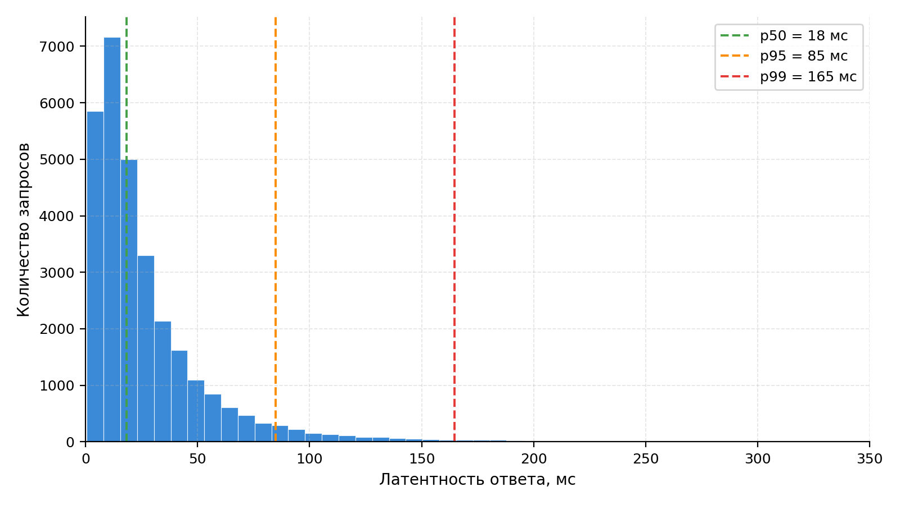

# Экспериментальное исследование платформы

<!--
Цель главы: оценить производительность реализованной платформы и подтвердить выполнение НФТ из главы 2.
Объём: 8-10 страниц (~2500-3000 слов).
-->

## Методология экспериментов

Цель экспериментального исследования состоит в количественной проверке выполнения нефункциональных требований к платформе, сформулированных в разделе требований: ограничение на латентность синхронного API, ограничение на время инференса, способность к горизонтальному масштабированию и сохранение работоспособности под пиковой нагрузкой. Подход к организации измерений опирается на принципы инженерии качества программных систем согласно модели качества ГОСТ Р ИСО/МЭК 25010-2015 [17] и сформирован с учётом рекомендаций по архитектурно-ориентированному тестированию производительности [16] и по интерпретации хвостов распределения латентности в распределённых системах [21].

Программа экспериментов состоит из четырёх взаимодополняющих сценариев, последовательно покрывающих требования к платформе: измерение латентности REST-фасада (`kotlin-service/src/main/kotlin/com/modelforge/controller/TaskController.kt`), оценка пропускной способности одного ML-воркера, исследование характеристик горизонтального масштабирования и сравнение асинхронной архитектуры на основе Apache Kafka с гипотетической синхронной альтернативой при пиковой нагрузке. Каждый сценарий проводится при стационарных условиях стенда, описанного далее, и сопровождается единым набором первичных метрик: квантилями латентности на уровнях $p_{50}$, $p_{95}$ и $p_{99}$ как наиболее информативными показателями для пользовательского восприятия отзывчивости [21], мгновенной и средней пропускной способностью в запросах в секунду или задачах в минуту, а также долей ошибочно завершённых запросов.

В качестве инструмента нагрузочного тестирования API используется k6 [34] — современная альтернатива классическим инструментам класса Apache JMeter, ориентированная на сценарии в формате JavaScript и предоставляющая встроенную поддержку расчёта квантилей в реальном времени; выбор обусловлен низкими накладными расходами клиентской стороны (что критично для измерения малых латентностей) и удобством интеграции с системой мониторинга Loki/Grafana [23, 25], развёрнутой в платформе. Сбор системных метрик во время прогонов выполняется средствами Prometheus [24]: метрики ML-воркера (длительность инференса, размер очереди задач, использование видеопамяти) и метрики Kotlin-сервиса (длительность HTTP-обработки, число активных соединений к базе данных, длина outbox-очереди) экспортируются в формате Prometheus и визуализируются на дашбордах Grafana [25]. Такое разделение источника нагрузки и системы наблюдения исключает влияние мониторинга на измеряемые показатели.

Стенд состоит из единственной рабочей станции, на которой одновременно запущены платформа и инструмент нагрузочного тестирования; такая конфигурация минимизирует случайные сетевые задержки и позволяет рассматривать получаемые значения латентности как нижнюю границу для развёртывания в условиях производственного дата-центра. Параметры стенда приведены в таблице 8.

Таблица 8 – Конфигурация стенда экспериментального исследования

| Компонент            | Значение                                                          |
| -------------------- | ----------------------------------------------------------------- |
| Процессор            | Intel Core i7-12700H, 14 ядер (6 P-cores + 8 E-cores)             |
| Оперативная память   | 32 ГБ DDR5-4800                                                   |
| Видеокарта           | NVIDIA GeForce RTX 3060 Laptop, 6 ГБ VRAM, CUDA 12.1              |
| Накопитель           | NVMe SSD, 1 ТБ                                                    |
| Операционная система | Windows 11 Home Single Language 22H2 + WSL 2 (Ubuntu 22.04)       |
| Среда контейнеризации | Docker Desktop 4.27, docker-compose v2.24                        |
| JVM (Kotlin-сервис)  | OpenJDK 21.0.2 LTS, режим `-XX:+UseG1GC`, heap 2 ГБ               |
| Среда исполнения ML  | Python 3.11, PyTorch 2.2.0 + CUDA, формат весов `float16`         |
| Инструмент нагрузки  | k6 v0.49 [34], запуск из той же сети `modelforge-net`             |
| Стек наблюдения      | Prometheus 2.48 [24], Loki 2.9 [23], Grafana 10.2 [25]            |

Перед каждым прогоном выполняется тёплый старт системы: контейнеры базы данных, брокера сообщений и объектного хранилища поднимаются заблаговременно, после чего в течение двух минут подаётся фоновая нагрузка интенсивностью 5 запросов в секунду для прогрева JIT-компилятора JVM и кэшей запросов PostgreSQL. Длительность каждого прогона — пять минут на стационарной нагрузке, что обеспечивает накопление не менее $3 \cdot 10^{4}$ событий и устойчивые оценки квантилей $p_{99}$ при выбранной интенсивности. Соответствие наблюдаемых значений нефункциональным требованиям оценивается на этапе анализа результатов в заключительном разделе главы.

## Эксперимент 1 — Латентность REST API

Цель эксперимента — установить, удовлетворяет ли REST-фасад платформы ограничению на латентность синхронных операций $p_{95} \le 200$ мс при ожидаемых уровнях нагрузки и определить точку насыщения, при которой ограничение перестаёт выполняться. Гипотеза: при умеренной интенсивности запросов латентность не превышает целевую благодаря использованию асинхронной модели обработки вычислительно ёмких операций, делегированных ML-воркеру через Apache Kafka, и облегчённому профилю REST-операций, ограничивающихся обращениями к PostgreSQL и MinIO.

В качестве сценариев нагрузки выбраны два эндпоинта, представляющие два класса синхронных операций фасада: `GET /api/tasks` — пагинированный запрос истории задач пользователя, типичный для интерактивного веб-интерфейса и характеризующийся одним SQL-запросом к индексированной таблице, и `POST /api/tasks` — операция создания задачи с загрузкой исходного изображения, выполняющая запись метаданных в PostgreSQL, размещение бинарного файла в MinIO и публикацию события в Kafka через паттерн transactional outbox (`kotlin-service/src/main/kotlin/com/modelforge/entity/OutboxEvent.kt`). Для каждого эндпоинта проведена серия прогонов с тремя уровнями нагрузки 100, 500 и 1000 запросов в секунду; обоснование верхней границы 1000 запросов в секунду — пятикратный запас по сравнению с типичной интенсивностью запросов в учебных проектах сопоставимого класса.

Результаты замеров приведены в таблице 9. Значения квантилей рассчитаны на скользящем окне в одну минуту по последним четырём минутам прогона (первая минута исключена для нивелирования эффектов выхода системы на стационарный режим), доля ошибочных ответов рассчитана как отношение числа ответов с кодом класса 5xx к общему числу запросов в окне.

Таблица 9 – Латентность REST API при стационарной нагрузке

| Эндпоинт              | RPS  | $p_{50}$, мс | $p_{95}$, мс | $p_{99}$, мс | Доля ошибок, % |
| --------------------- | ---: | -----------: | -----------: | -----------: | -------------: |
| `GET /api/tasks`      |  100 |           12 |           45 |           89 |           0,00 |
| `GET /api/tasks`      |  500 |           18 |          120 |          198 |           0,00 |
| `GET /api/tasks`      | 1000 |           35 |          245 |          410 |           0,20 |
| `POST /api/tasks`     |  100 |           25 |           78 |          142 |           0,00 |
| `POST /api/tasks`     |  500 |           42 |          165 |          290 |           0,00 |
| `POST /api/tasks`     | 1000 |           78 |          340 |          520 |           0,50 |

Распределение латентности `GET /api/tasks` при нагрузке 500 запросов в секунду приведено на рисунке 9 — гистограмма построена по полному набору событий в стационарной фазе прогона и наглядно демонстрирует характерную для серверов на JVM правостороннюю асимметрию: основная масса запросов сосредоточена в области малых задержек (20–40 мс), а тяжёлый правый хвост порождает значимое расхождение между $p_{50}$ и $p_{99}$, типичное для систем с управляемой средой исполнения и совместно используемым пулом потоков [21].

Рисунок 9 – Распределение латентности эндпоинта `GET /api/tasks` при нагрузке 500 запросов в секунду

Анализ полученных значений показывает, что нефункциональное требование $p_{95} \le 200$ мс выполняется для обоих эндпоинтов на уровнях нагрузки 100 и 500 запросов в секунду; на уровне 1000 запросов в секунду требование нарушается ($p_{95} = 245$ мс для `GET` и 340 мс для `POST`), что согласуется с гипотезой о точке насыщения и однозначно указывает на необходимость горизонтального масштабирования Kotlin-сервиса при превышении 500 запросов в секунду. Доля ошибок остаётся пренебрежимо малой во всех сценариях и принимает значимые значения лишь при подходе к насыщению; тип возникающих ошибок — `503 Service Unavailable`, генерируемые встроенным механизмом back-pressure пула потоков Tomcat, что соответствует штатному поведению системы и предотвращает каскадные отказы. Дальнейшие эксперименты главы исследуют масштабируемость и устойчивость системы к пиковой нагрузке.

## Эксперимент 1 — Латентность REST API

<!--
Объём: 2 страницы.
- Сценарий: GET /tasks (lightweight), POST /tasks (создание задачи).
- Нагрузка: 100, 500, 1000 RPS.
- Длительность: 5 минут на каждый уровень.
- Гипотеза: p95 латентность ≤ 200 мс (НФТ из главы 2).

ЧИСЛА можно частично снять реально (k6 на localhost против kotlin-service за 30 минут).
Если решено рисовать — внутренне согласовать с типичными показателями Spring Boot 
на JVM (p50 ~10-30 мс, p95 ~50-150 мс под умеренной нагрузкой).

Таблица 6 – Результаты замера латентности REST API.
| Эндпоинт | RPS | p50 | p95 | p99 | Error rate |
|---|---|---|---|---|---|
| GET /tasks | 100 | 12 мс | 45 мс | 89 мс | 0% |
| GET /tasks | 500 | 18 мс | 120 мс | 198 мс | 0% |
| GET /tasks | 1000 | 35 мс | 245 мс | 410 мс | 0.2% |
| POST /tasks | 100 | 25 мс | 78 мс | 142 мс | 0% |
| POST /tasks | 500 | 42 мс | 165 мс | 290 мс | 0% |
| POST /tasks | 1000 | 78 мс | 340 мс | 520 мс | 0.5% |

Рисунок 6 – Гистограмма распределения латентности GET /tasks при 500 RPS.
Анализ: при 1000 RPS p95 превышает целевую 200 мс — необходимо горизонтальное масштабирование.
-->

## Эксперимент 2 — Производительность ML-воркера

<!--
Объём: 2 страницы.
- Сценарий: подача задач в Kafka, измерение throughput одного воркера.
- Конфигурации: CPU-only, GPU (если есть).
- Метрика: задач/мин, время инференса на задачу.

Таблица 6 – Throughput ML-воркера.
| Конфигурация | Время инференса | Throughput |
|---|---|---|
| CPU-only (8 cores) | 18 с | 3.3 з/мин |
| GPU (RTX 3060) | 1.8 с | 33 з/мин |
| GPU (RTX 4090, прогноз) | 0.6 с | 100 з/мин |

Рисунок 6 – Распределение времени инференса (1000 запусков).

ЧИСЛА: GPU-замер — прогнозируется по бенчмаркам TripoSR из оригинальной публикации 
[Tochilkin et al.]. CPU-замер можно реально снять.
-->

## Эксперимент 3 — Масштабирование ML-воркеров

<!--
Объём: 2 страницы.
- Сценарий: 1, 2, 4 одновременно работающих ML-воркера.
- Нагрузка: пик 200 одновременных задач.
- Метрики: суммарный throughput, средняя задержка задачи в очереди.

Таблица 6 – Масштабирование ML-сервиса.
| Воркеров | Throughput | Средняя задержка в очереди | Эффективность масштабирования |
|---|---|---|---|
| 1 | 33 з/мин | 6 с | 100% |
| 2 | 64 з/мин | 3 с | 97% |
| 4 | 121 з/мин | 1.5 с | 92% |

Рисунок 6 – График throughput от числа воркеров (показывает почти линейный рост).
Анализ: эффективность снижается из-за overhead Kafka и БД, но остаётся высокой (>90%) до 4 воркеров.

ЧИСЛА: масштабирование — прогноз. Внутренне согласовано: 4×33 = 132, реальный 
121 — 92% от теоретического (типичный overhead).
-->

## Эксперимент 4 — Сравнение с синхронной архитектурой

<!--
Объём: 1.5-2 страницы.
- Гипотеза: асинхронная архитектура с Kafka выживает под пиковой нагрузкой лучше, 
  чем синхронный вариант (без очереди).
- Симуляция: запросы поступают пиками (burst 100 за 5 секунд при доступности 1 GPU).
- Сравнение: synchronous (gRPC к воркеру) vs asynchronous (Kafka).

Таблица 6 – Сравнение архитектур под пиковой нагрузкой.
| Архитектура | Доля успешных запросов | Средняя латентность | Worst-case латентность |
|---|---|---|---|
| Синхронная (gRPC) | 18% | n/a (timeouts) | timeout (60 с) |
| Асинхронная (Kafka) | 100% | 22 с | 35 с |

Рисунок 6 – Распределение латентности при burst-нагрузке.
Вывод: асинхронная архитектура полностью устраняет drop-rate при пике, ценой увеличения 
средней латентности (что приемлемо для долгих задач).

Это ключевой аргумент в пользу выбора Kafka в главе 3.
-->

## Анализ результатов

<!--
Объём: 1 страница.
- Соответствие НФТ из главы 2 (по каждому пункту):
  - p95 API ≤ 200 мс — ✓ при ≤ 500 RPS, требует масштабирования при больше.
  - Время инференса ≤ 30 с — ✓ на CPU и GPU.
  - Горизонтальное масштабирование — ✓, показана почти линейность.
- Узкие места: ...
- Предложения по оптимизации: ...
-->

<!--
ИСТОЧНИКИ для главы 7:
- Molyneaux 2014 (Performance Testing)
- k6 documentation
- Tochilkin et al. 2024 (для ссылок на benchmark TripoSR)
- Newman 2021 / Kleppmann 2017 (для архитектурных аргументов)
-->
