# ModelForge Frontend

React SPA for the ModelForge 3D model generation platform. Provides user authentication, task creation with image upload, real-time task tracking, and 3D model download.

## Table of Contents

- [Overview](#overview)
- [Architecture](#architecture)
- [Tech Stack](#tech-stack)
- [Setup & Installation](#setup--installation)
- [Pages & Routing](#pages--routing)
- [State Management](#state-management)
- [API Integration](#api-integration)
- [Authentication Flow](#authentication-flow)
- [Task Lifecycle](#task-lifecycle)
- [Deployment](#deployment)
- [Future Improvements](#future-improvements)

## Overview

The frontend is a lightweight React SPA built with Vite. It communicates with the Kotlin Service REST API to allow users to:

- **Register and log in** with JWT-based authentication
- **Upload images** (JPG, PNG, WebP) to create 3D generation tasks
- **Monitor task progress** on a filterable, paginated dashboard
- **Download generated 3D models** when processing completes

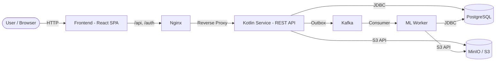

## Architecture

The application follows a modular structure with clear separation between pages, shared components, API layer, and state management.

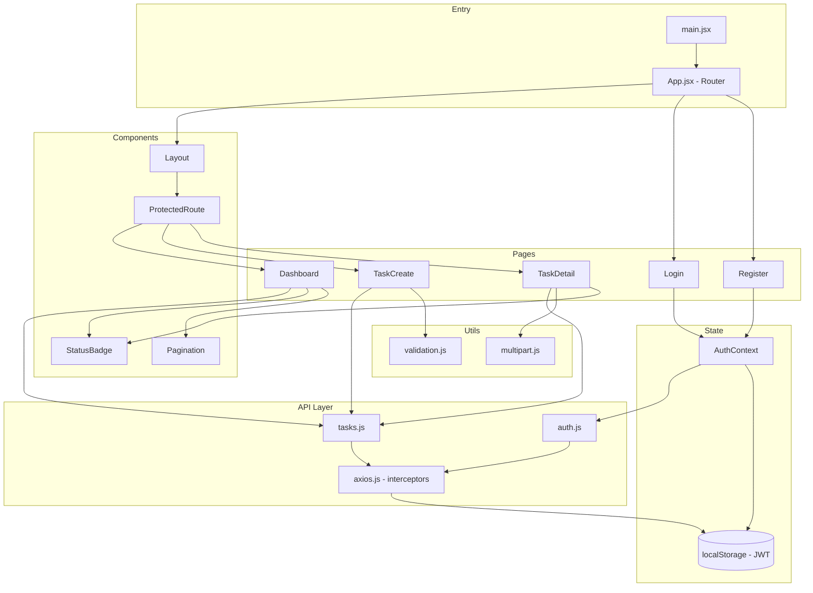

### Directory Structure

```
frontend/
├── src/
│   ├── api/                    # Backend API integration
│   │   ├── axios.js            # Axios instance with JWT interceptors
│   │   ├── auth.js             # Auth endpoints (login, register)
│   │   └── tasks.js            # Task CRUD & download endpoints
│   ├── components/             # Reusable UI components
│   │   ├── Layout.jsx          # App shell (header, nav, logout)
│   │   ├── ProtectedRoute.jsx  # Auth guard → redirects to /login
│   │   ├── StatusBadge.jsx     # Task status visual indicator
│   │   ├── Pagination.jsx      # Page navigation controls
│   │   └── *.module.css        # Component-scoped styles
│   ├── context/                # React Context providers
│   │   └── AuthContext.jsx     # Auth state, JWT decode, login/logout
│   ├── pages/                  # Route-level page components
│   │   ├── Login.jsx           # Email/password login form
│   │   ├── Register.jsx        # New account registration form
│   │   ├── Dashboard.jsx       # Task list with filters & pagination
│   │   ├── TaskCreate.jsx      # Image upload + prompt form
│   │   ├── TaskDetail.jsx      # Task info with auto-polling & download
│   │   └── *.module.css        # Page-scoped styles
│   ├── utils/                  # Utility functions
│   │   ├── validation.js       # File type & size validation
│   │   └── multipart.js        # Multipart response parsing
│   ├── styles/
│   │   └── global.css          # CSS variables & base styles
│   ├── main.jsx                # React DOM entry point
│   └── App.jsx                 # Route definitions
├── public/
│   └── index.html              # HTML template
├── package.json                # Dependencies & scripts
├── vite.config.js              # Vite build config + dev proxy
├── Dockerfile                  # Multi-stage Docker build
└── nginx.conf                  # Production reverse proxy config
```

### Key Design Decisions

| Decision | Rationale |
|---|---|
| **Vite over CRA** | Faster HMR, smaller bundles, modern ESM-native tooling |
| **React Context over Redux** | Simple auth state doesn't need external state management |
| **CSS Modules** | Scoped styles without runtime cost; no CSS-in-JS dependency |
| **Axios interceptors** | Centralized JWT injection and 401 handling in one place |
| **Polling over WebSocket** | Simpler to implement; sufficient for current task update frequency |

## Tech Stack

| Category | Technology | Version |
|---|---|---|
| UI Library | React | 18.3.1 |
| Routing | React Router DOM | 6.23.1 |
| HTTP Client | Axios | 1.7.2 |
| Build Tool | Vite | 5.3.1 |
| Language | JavaScript (JSX) | ES2020+ |
| Styling | CSS Modules | — |
| Production Server | Nginx | Alpine |
| Containerization | Docker (multi-stage) | Node 18 + Nginx |

## Setup & Installation

### Prerequisites

- Node.js 18+
- npm 9+

### Run Locally (Development Mode)

```bash
cd frontend
npm install
npm run dev
```

The app will be available at `http://localhost:5173`. The dev server proxies `/api` and `/auth` requests to `http://localhost:8080` (Kotlin service).

### Run with Backend

Start the Kotlin service first (see `kotlin-service/README.md`), then:

```bash
cd frontend
npm run dev
```

### Build for Production

```bash
cd frontend
npm run build    # outputs to dist/
npm run preview  # preview production build locally
```

### Run via Docker

```bash
cd frontend
docker build -t modelforge-frontend .
docker run -p 80:80 modelforge-frontend
```

### Full Stack

```bash
cd deploy
docker-compose -f docker-compose.yml \
  -f docker-compose.infra.yml \
  -f docker-compose.app.yml \
  -f docker-compose.frontend.yml \
  up -d --build
```

## Pages & Routing

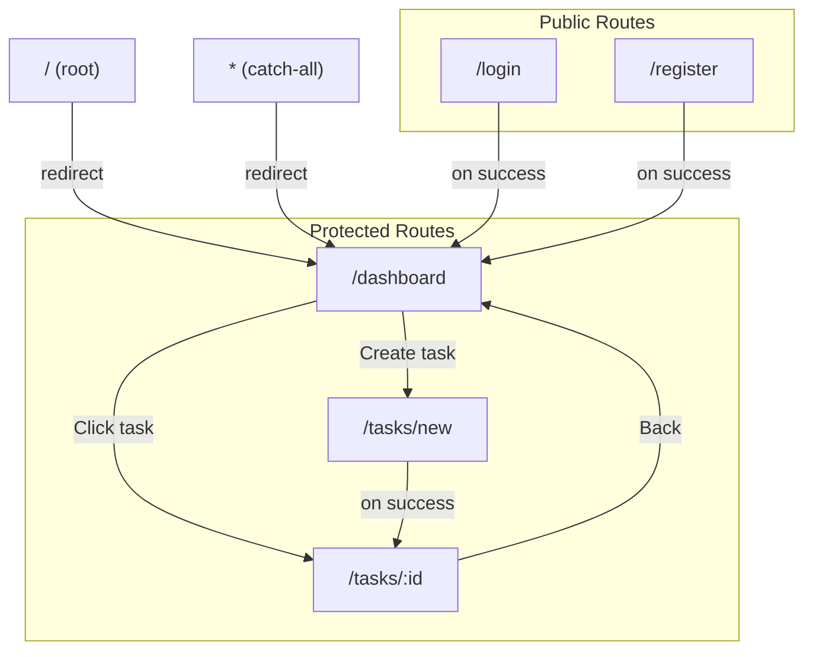

| Route | Page | Auth | Description |
|---|---|---|---|
| `/login` | Login | Public | Email/password login form |
| `/register` | Register | Public | New account creation |
| `/dashboard` | Dashboard | Protected | Task list with status filter and pagination |
| `/tasks/new` | TaskCreate | Protected | Image upload with drag-drop and optional prompt |
| `/tasks/:id` | TaskDetail | Protected | Task details, auto-polling, 3D model download |
| `*` | — | — | Redirects to `/dashboard` |

## State Management

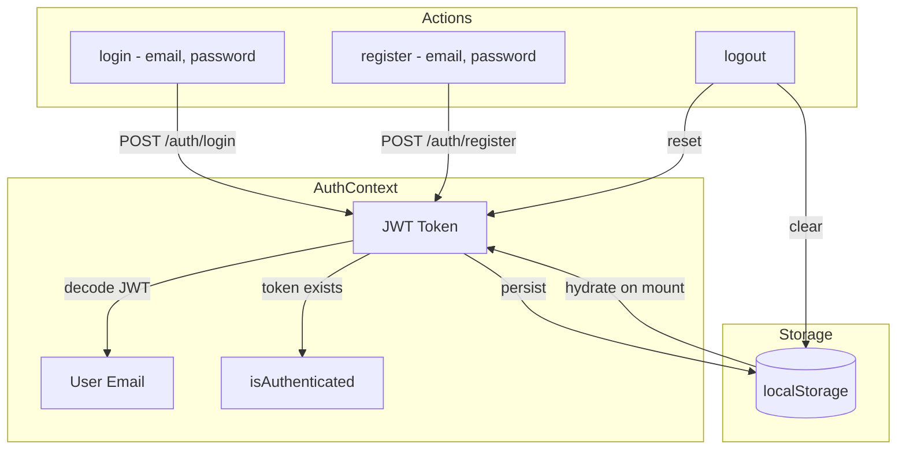

**Authentication state** is managed via React Context (`AuthContext`):

- On login/register, the JWT token is stored in `localStorage` and decoded to extract the user email
- `isAuthenticated` is derived from the token's presence
- On app mount, the context hydrates from `localStorage` (persists across page reloads)
- `logout()` clears localStorage and resets state

**Component state** uses React hooks (`useState`, `useEffect`) for local concerns:

- Dashboard: tasks list, current page, total pages, status filter, loading/error
- TaskCreate: selected file, image preview, prompt text, upload progress
- TaskDetail: task object, polling interval (3s until terminal state)

## API Integration

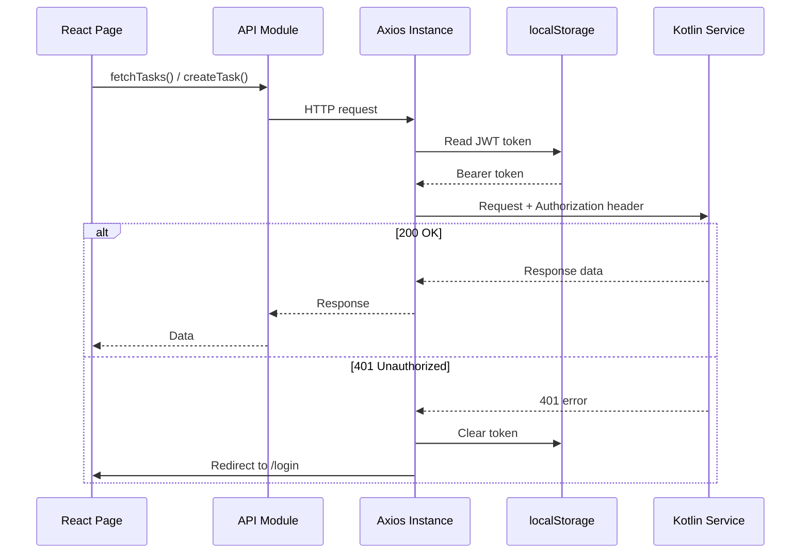

### Axios Interceptors

- **Request interceptor** — Reads JWT from `localStorage`, attaches `Authorization: Bearer <token>` header to every request
- **Response interceptor** — On `401` response, clears the stored token and redirects to `/login`

### API Modules

**`auth.js`**
- `login(email, password)` — `POST /auth/login`
- `register(email, password)` — `POST /auth/register`

**`tasks.js`**
- `getTasks(page, size, status)` — `GET /api/tasks` with query params
- `getTask(id)` — `GET /api/tasks/:id`
- `createTask(file, prompt, onProgress)` — `POST /api/tasks` multipart/form-data
- `downloadTask(id)` — `GET /api/tasks/:id/download`

## Authentication Flow

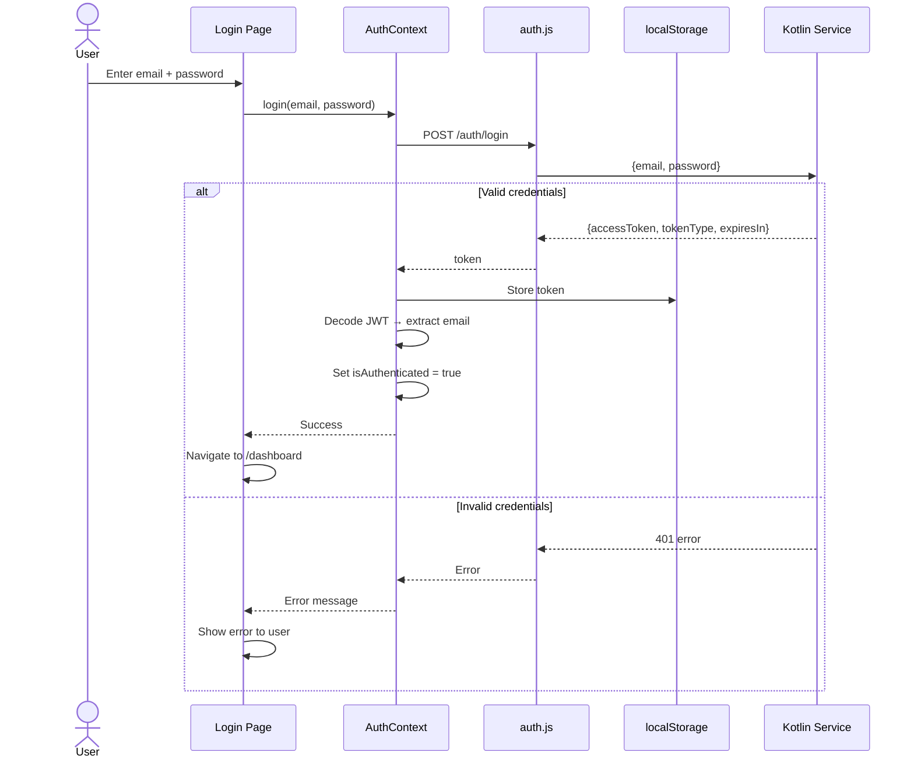

### Route Protection

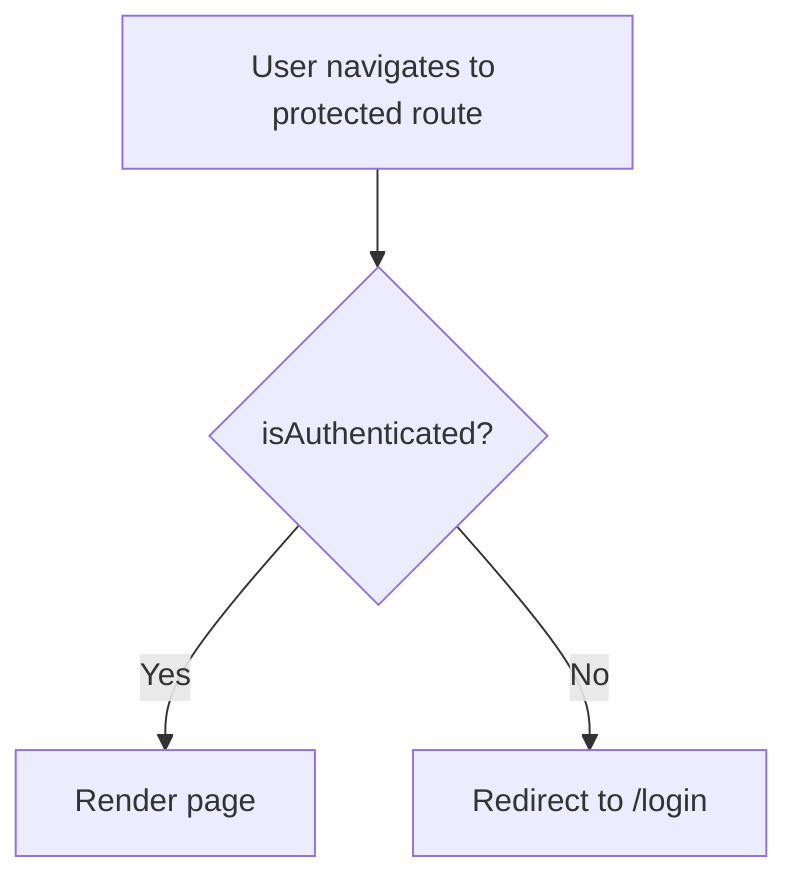

`ProtectedRoute` wraps all authenticated pages. It checks `isAuthenticated` from `AuthContext` and redirects unauthenticated users to `/login`.

## Task Lifecycle

### Task Creation

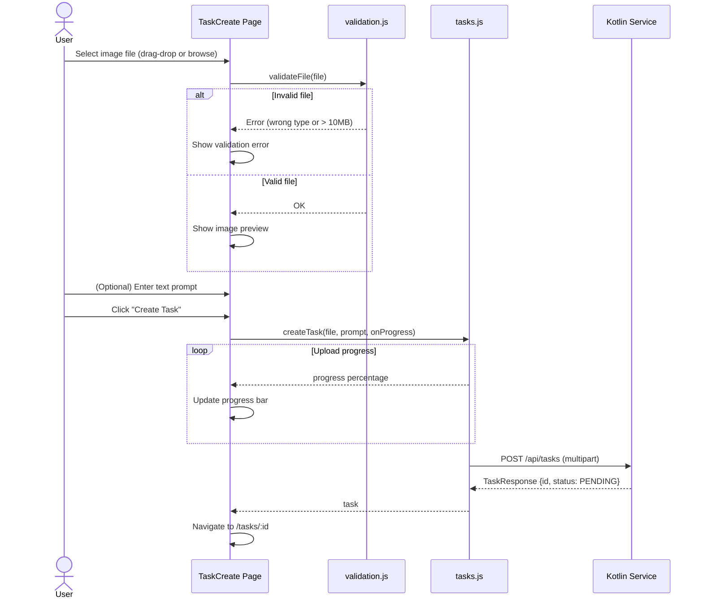

### Task Monitoring & Download

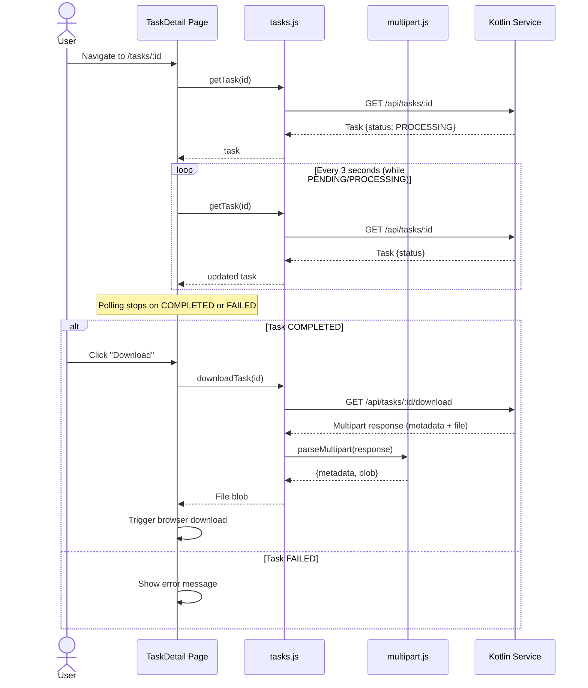

### Task Status State Machine

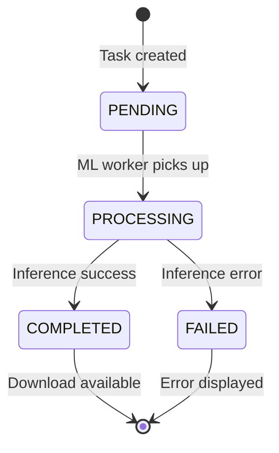

## Deployment

### Docker Build (Multi-stage)

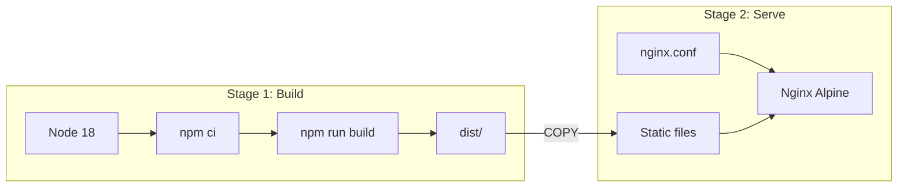

### Nginx Routing

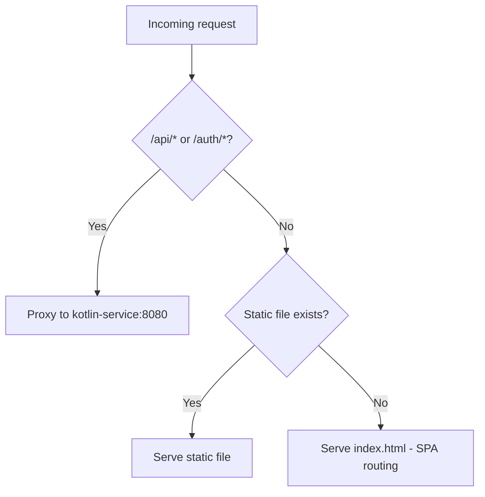

### Nginx Configuration

| Setting | Value |
|---|---|
| SPA routing | `try_files $uri $uri/ /index.html` |
| API proxy | `/api/` and `/auth/` → `http://kotlin-service:8080` |
| Max upload size | 15 MB |
| Health check | `/health` endpoint |

### Docker Compose Configuration

| Setting | Value |
|---|---|
| Port | `80` (configurable via `FRONTEND_PORT`) |
| Memory limit | 128 MB |
| CPU limit | 0.25 cores |
| Depends on | `kotlin-service` |

### File Validation Rules

| Rule | Value |
|---|---|
| Allowed formats | JPG, JPEG, PNG, WebP |
| Max file size | 10 MB |
| Upload method | Multipart form-data |
| Progress tracking | Axios `onUploadProgress` |

## Future Improvements

- **WebSocket notifications** — Replace polling with real-time push updates for task status
- **3D model viewer** — In-browser preview of generated GLB models using Three.js
- **Dark mode** — Theme toggle with CSS variable switching
- **Internationalization (i18n)** — Multi-language support (Russian / English)
- **Offline support** — Service worker for caching static assets and pending uploads
- **E2E tests** — Playwright or Cypress for end-to-end testing
- **Error boundaries** — React error boundaries for graceful failure handling
- **Skeleton loading** — Improve perceived performance with skeleton screens
