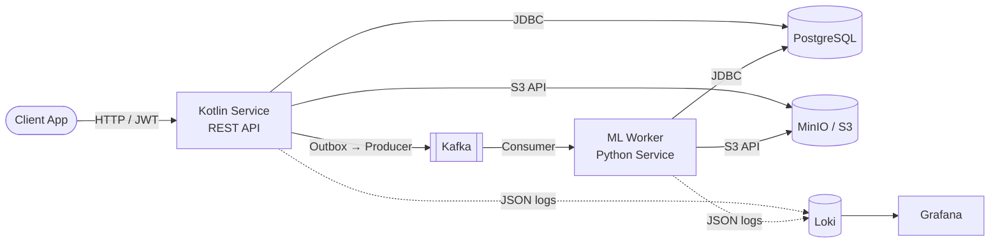
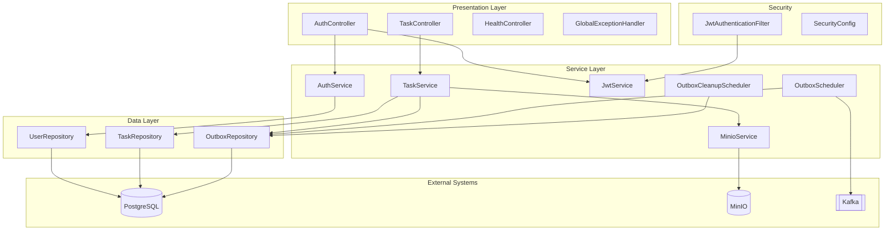
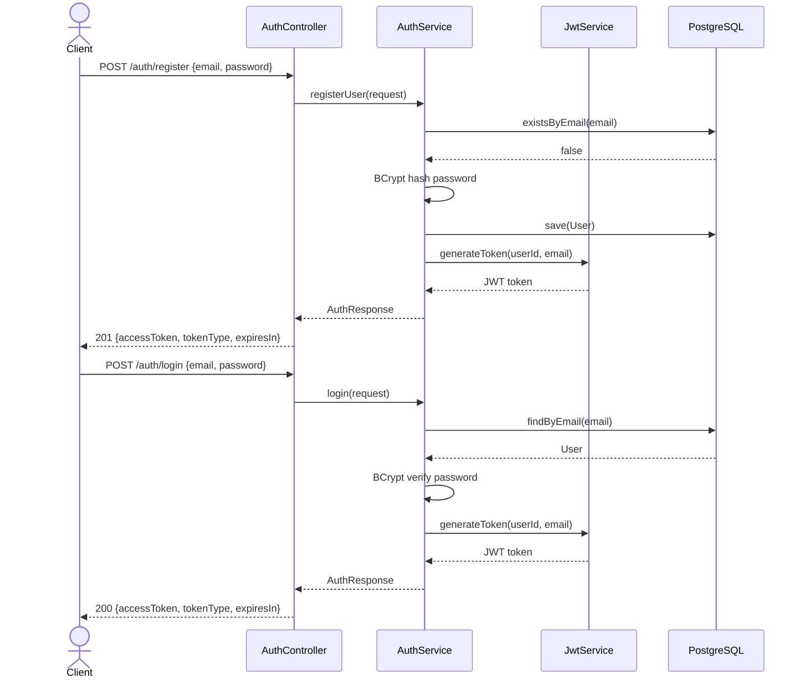
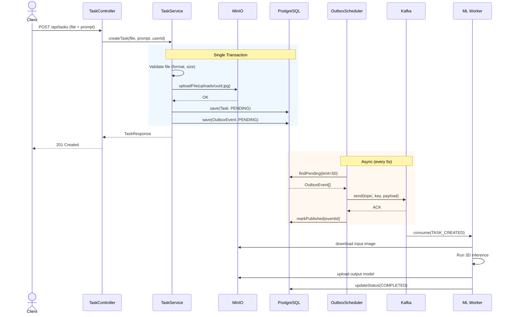
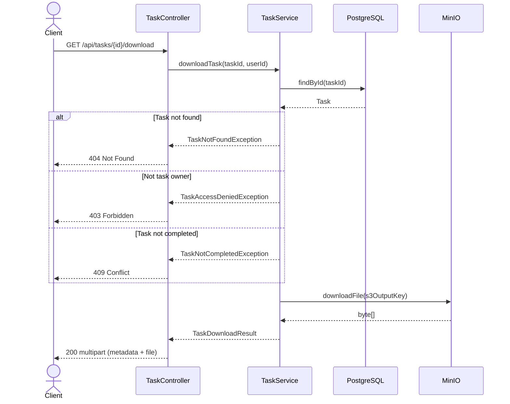
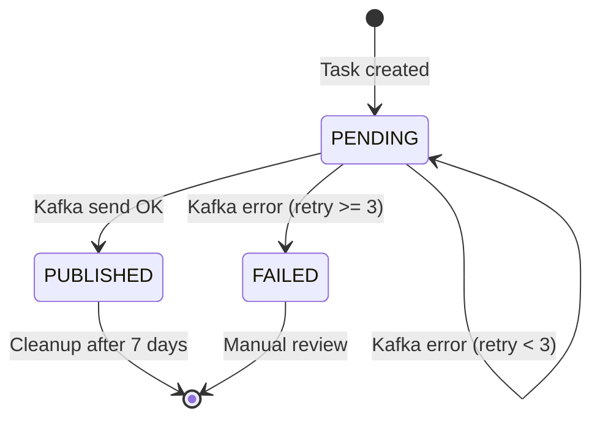
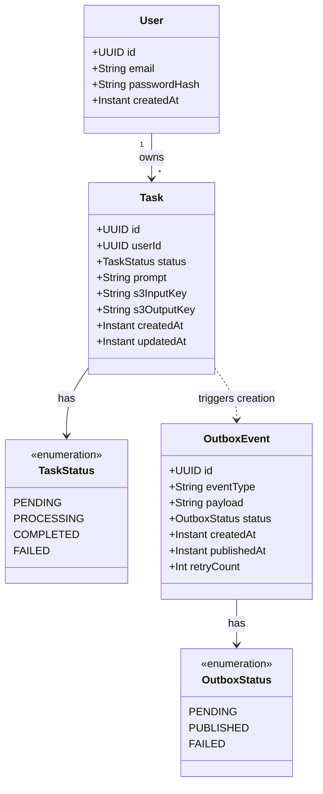

# ModelForge Kotlin Service

REST API gateway for the ModelForge 3D model generation platform. Handles user authentication, task management, file uploads, and reliable event publishing to Kafka via the transactional outbox pattern.

## Table of Contents

- [Overview](#overview)
- [Architecture](#architecture)
- [Tech Stack](#tech-stack)
- [Setup & Installation](#setup--installation)
- [API Reference](#api-reference)
- [Data Flow](#data-flow)
- [Domain Model](#domain-model)
- [Error Handling](#error-handling)
- [Testing](#testing)
- [Future Improvements](#future-improvements)

## Overview

The Kotlin service is the API layer of the ModelForge platform. It exposes a REST API that allows users to:

- **Register and authenticate** via JWT tokens
- **Submit 3D generation tasks** by uploading images (JPG, PNG, WebP)
- **Track task progress** with paginated, filterable queries
- **Download generated 3D models** when processing completes

Tasks are persisted in PostgreSQL and published to Kafka using the **transactional outbox pattern**, ensuring reliable event delivery to the downstream ML worker (Python service) that performs the actual 3D model generation.



## Architecture

The service follows a **layered architecture** with clear separation of concerns.



### Package Structure

```
com.modelforge
├── Application.kt              # Spring Boot entry point
├── controller/                  # REST endpoints + exception handler
├── service/                     # Business logic + scheduled jobs
├── repository/                  # JdbcTemplate-based data access
├── entity/                      # Domain models (Task, User, OutboxEvent)
├── dto/                         # Request/response DTOs
├── security/                    # JWT filter + Spring Security config
├── config/                      # MinIO, Kafka, OpenAPI, metrics beans
└── exception/                   # Custom exception types
```

### Key Design Decisions

| Decision | Rationale |
|---|---|
| **JdbcTemplate over JPA/Hibernate** | Explicit SQL, no magic; full control over queries |
| **Transactional outbox pattern** | Guarantees task creation and Kafka event are atomic |
| **Stateless JWT auth** | Horizontally scalable, no session storage needed |
| **Liquibase migrations** | Version-controlled, repeatable database schema |
| **Profile-based config** | Seamless switch between H2 (dev) and PostgreSQL (prod) |

## Tech Stack

| Category | Technology | Version |
|---|---|---|
| Language | Kotlin | 1.9.22 |
| Framework | Spring Boot | 3.2.2 |
| Build | Gradle (Kotlin DSL) | 8.5 |
| Runtime | JDK | 17 |
| Database | PostgreSQL / H2 (dev) | — |
| Migrations | Liquibase | 4.x |
| Messaging | Apache Kafka | via spring-kafka |
| Object Storage | MinIO (S3-compatible) | 8.5.7 |
| Auth | JWT (jjwt) | 0.12.3 |
| API Docs | SpringDoc OpenAPI (Swagger) | 2.3.0 |
| Metrics | Micrometer + Prometheus | — |
| Logging | Logback + Logstash encoder | 7.4 |
| Testing | JUnit 5, Mockito-Kotlin, Spring Test | — |

## Setup & Installation

### Prerequisites

- JDK 17+
- Docker & Docker Compose (for infrastructure)
- Gradle 8.5+ (or use the included wrapper `./gradlew`)

### Run Locally (Development Mode)

The service uses an in-memory H2 database and mocked external services by default, so you can run it standalone:

```bash
cd kotlin-service
./gradlew bootRun
```

The API will be available at `http://localhost:8080`. Swagger UI is at `http://localhost:8080/swagger-ui/index.html`.

### Run with Infrastructure

Start infrastructure from the `deploy/` directory:

```bash
cd deploy
cp .env.example .env  # first time only
docker-compose -f docker-compose.yml -f docker-compose.infra.yml up -d
```

Then run the service with the Docker profile:

```bash
cd kotlin-service
./gradlew bootRun --args='--spring.profiles.active=docker'
```

### Run via Docker

```bash
cd kotlin-service
docker build -t modelforge-kotlin-service .
docker run -p 8080:8080 \
  -e SPRING_PROFILES_ACTIVE=docker \
  -e POSTGRES_HOST=host.docker.internal \
  -e JWT_SECRET_KEY=your-secret-min-32-chars-long!! \
  -e MINIO_ACCESS_KEY=minioadmin \
  -e MINIO_SECRET_KEY=minioadmin \
  modelforge-kotlin-service
```

### Full Stack

```bash
cd deploy
docker-compose -f docker-compose.yml \
  -f docker-compose.infra.yml \
  -f docker-compose.logging.yml \
  -f docker-compose.app.yml \
  up -d --build
```

### Configuration

All settings are in `src/main/resources/application.yml` (dev) and `application-docker.yml` (production). Key environment variables:

| Variable | Description | Default |
|---|---|---|
| `POSTGRES_HOST` | PostgreSQL host | `postgres` |
| `POSTGRES_PORT` | PostgreSQL port | `5432` |
| `POSTGRES_DB` | Database name | `modelforge_db` |
| `POSTGRES_USER` | Database user | `modelforge` |
| `POSTGRES_PASSWORD` | Database password | `changeme` |
| `KAFKA_BOOTSTRAP_SERVERS` | Kafka brokers | `kafka:9092` |
| `MINIO_ENDPOINT` | MinIO endpoint | `http://minio:9000` |
| `MINIO_ACCESS_KEY` | MinIO access key | — |
| `MINIO_SECRET_KEY` | MinIO secret key | — |
| `JWT_SECRET_KEY` | JWT signing secret (min 32 chars) | — |

## API Reference

### Authentication

All `/api/**` endpoints require a JWT token in the `Authorization` header:

```
Authorization: Bearer <token>
```

Public endpoints: `/auth/**`, `/health`, `/actuator/**`, `/swagger-ui/**`.

---

### POST /auth/register

Register a new user account.

**Request:**
```json
{
  "email": "user@example.com",
  "password": "securePassword123"
}
```

**Response (201 Created):**
```json
{
  "accessToken": "eyJhbGciOiJIUzI1NiJ9...",
  "tokenType": "Bearer",
  "expiresIn": 86400
}
```

**Errors:**
- `400` — Email already registered or validation failed

---

### POST /auth/login

Authenticate and receive a JWT token.

**Request:**
```json
{
  "email": "user@example.com",
  "password": "securePassword123"
}
```

**Response (200 OK):**
```json
{
  "accessToken": "eyJhbGciOiJIUzI1NiJ9...",
  "tokenType": "Bearer",
  "expiresIn": 86400
}
```

**Errors:**
- `401` — Invalid credentials

---

### POST /api/tasks

Create a new 3D generation task by uploading an image.

**Request:** `multipart/form-data`

| Field | Type | Required | Description |
|---|---|---|---|
| `file` | binary | yes | Image file (jpg, jpeg, png, webp), max 10 MB |
| `prompt` | string | no | Text prompt for generation |

```bash
curl -X POST http://localhost:8080/api/tasks \
  -H "Authorization: Bearer <token>" \
  -F "file=@photo.jpg" \
  -F "prompt=Generate a 3D model"
```

**Response (201 Created):**
```json
{
  "id": "a1b2c3d4-e5f6-7890-abcd-ef1234567890",
  "userId": "f0e1d2c3-b4a5-6789-0abc-def123456789",
  "status": "PENDING",
  "prompt": "Generate a 3D model",
  "s3InputKey": "uploads/a1b2c3d4.jpg",
  "s3OutputKey": null,
  "createdAt": "2026-03-25T10:00:00Z",
  "updatedAt": "2026-03-25T10:00:00Z"
}
```

**Errors:**
- `400` — Invalid file format, file too large, or empty file

---

### GET /api/tasks

List the authenticated user's tasks with pagination and optional status filtering.

**Query Parameters:**

| Parameter | Type | Default | Description |
|---|---|---|---|
| `page` | int | 0 | Page number (zero-based) |
| `size` | int | 20 | Page size (max 100) |
| `status` | string | — | Filter: `PENDING`, `PROCESSING`, `COMPLETED`, `FAILED` |

```bash
curl http://localhost:8080/api/tasks?page=0&size=10&status=COMPLETED \
  -H "Authorization: Bearer <token>"
```

**Response (200 OK):**
```json
{
  "content": [
    {
      "id": "a1b2c3d4-e5f6-7890-abcd-ef1234567890",
      "userId": "f0e1d2c3-b4a5-6789-0abc-def123456789",
      "status": "COMPLETED",
      "prompt": "Generate a 3D model",
      "s3InputKey": "uploads/a1b2c3d4.jpg",
      "s3OutputKey": "outputs/a1b2c3d4.glb",
      "createdAt": "2026-03-25T10:00:00Z",
      "updatedAt": "2026-03-25T10:05:00Z"
    }
  ],
  "page": 0,
  "size": 10,
  "totalElements": 1,
  "totalPages": 1
}
```

---

### GET /api/tasks/{id}

Get a specific task by ID. Returns `403` if the task belongs to another user.

**Response (200 OK):** Same as single task object above.

**Errors:**
- `404` — Task not found
- `403` — Access denied (not the task owner)

---

### GET /api/tasks/{id}/download

Download the generated 3D model file. Only available for completed tasks.

**Response (200 OK):** `multipart/form-data` with two parts:
1. **metadata** (JSON): `{ "task_id": "uuid", "format": "glb", "generated_at": "..." }`
2. **file** (binary): The generated 3D model file

**Errors:**
- `404` — Task not found
- `403` — Access denied
- `409` — Task not yet completed

---

### GET /health

Health check endpoint (public).

**Response (200 OK):**
```json
{
  "status": "UP",
  "service": "modelforge-kotlin-service",
  "timestamp": "2026-03-25T10:00:00Z"
}
```

---

### Authentication Flow



## Data Flow

### Task Creation & Processing



### Task Download



### Outbox Event Lifecycle



## Domain Model



### Database Schema

Managed by Liquibase. Three tables:

- **`users`** — User accounts with BCrypt password hashes. Unique index on `email`.
- **`tasks`** — Generation tasks linked to users. Indexes on `user_id`, `status`, `created_at`.
- **`outbox_events`** — Transactional outbox for Kafka. Indexes on `status`, `created_at`.

## Error Handling

The service uses a centralized `GlobalExceptionHandler` (`@RestControllerAdvice`) that maps exceptions to consistent JSON error responses:

```json
{
  "code": "TASK_NOT_FOUND",
  "message": "Task with id a1b2c3d4-... not found",
  "timestamp": "2026-03-25T10:00:00Z"
}
```

| Exception | HTTP Status | Code |
|---|---|---|
| `TaskNotFoundException` | 404 | `TASK_NOT_FOUND` |
| `TaskAccessDeniedException` | 403 | `TASK_ACCESS_DENIED` |
| `TaskNotCompletedException` | 409 | `TASK_NOT_COMPLETED` |
| `InvalidFileException` | 400 | `INVALID_FILE` |
| `MaxUploadSizeExceededException` | 400 | `FILE_TOO_LARGE` |
| `MethodArgumentNotValidException` | 400 | `VALIDATION_ERROR` |
| Unhandled exceptions | 500 | `INTERNAL_ERROR` |

### File Validation Rules

- File must not be empty
- Maximum size: 10 MB
- Allowed formats: `jpg`, `jpeg`, `png`, `webp`

## Testing

### Run Unit Tests

```bash
cd kotlin-service
./gradlew test
```

### Run Integration Tests

```bash
cd kotlin-service
./gradlew integrationTest
```

### Run All Tests

```bash
cd kotlin-service
./gradlew check
```

### Test Structure

```
src/test/                              # Unit & controller tests
├── controller/
│   ├── AuthControllerTest.kt          # Auth API: register, login, validation
│   └── TaskControllerTest.kt          # Task API: CRUD, multipart, pagination
├── service/
│   ├── AuthServiceTest.kt             # Registration, login, password hashing
│   ├── JwtServiceTest.kt              # Token generation & validation
│   ├── TaskServiceTest.kt             # File validation, outbox event creation
│   └── OutboxSchedulerTest.kt         # Publish, retry, failure handling
└── config/
    └── TestSecurityConfig.kt          # Test-specific security setup

src/integrationTest/                   # Integration tests (H2, mocked Kafka/MinIO)
├── FullFlowIntegrationTest.kt         # End-to-end: register → create → list tasks
├── OutboxMechanismIntegrationTest.kt  # Outbox publish, retry, cleanup lifecycle
└── SecurityIntegrationTest.kt         # JWT validation, user isolation, public endpoints
```

### Test Configuration

- **Unit tests** use the `test` profile with H2 in-memory database. Kafka and MinIO are mocked.
- **Integration tests** use the `integration` profile with H2 and mocked external services.
- External services (Kafka, MinIO) are excluded from auto-configuration in test profiles.

## Future Improvements

- **WebSocket notifications** — Push task status updates to clients in real-time instead of polling
- **Rate limiting** — Protect endpoints from abuse with request throttling
- **File type detection** — Validate file content (magic bytes) in addition to extension
- **Real ML backend integration** — Replace mock inference with TripoSR or similar model
- **Retry/DLQ for failed tasks** — Automatic retry with dead-letter queue for failed ML processing
- **User management** — Password reset, email verification, role-based access control
- **API versioning** — Version endpoints (`/v1/api/tasks`) for backward compatibility
- **Caching** — Cache completed task metadata to reduce database load
